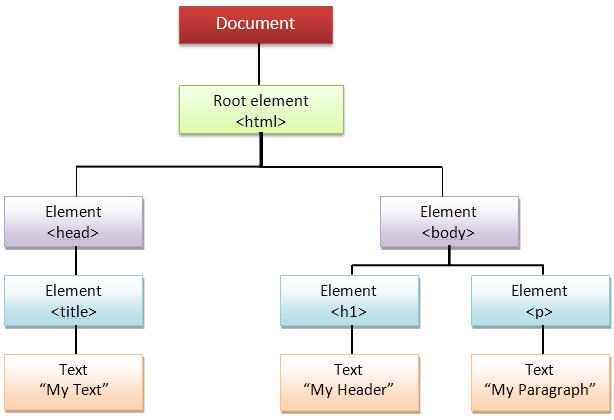
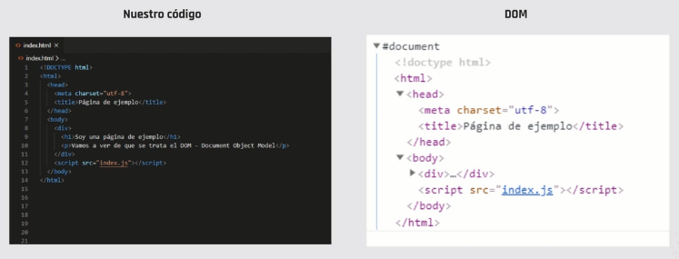
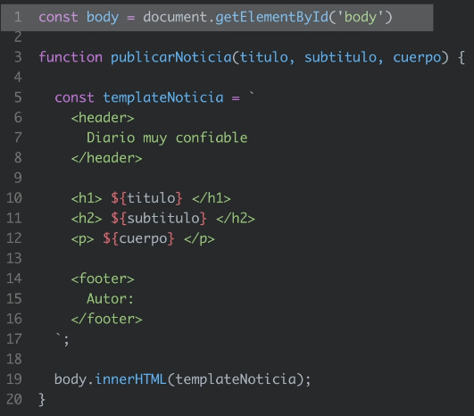
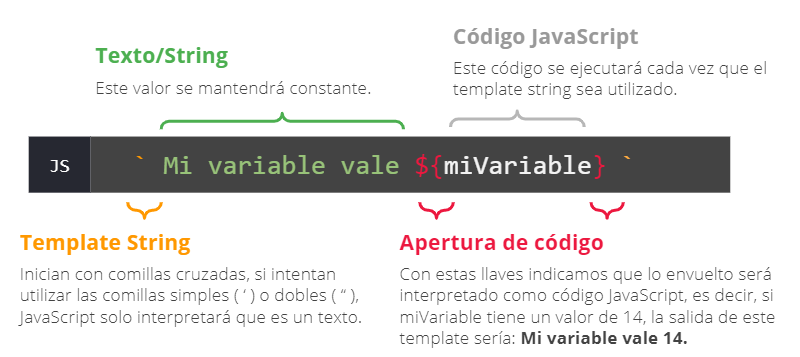
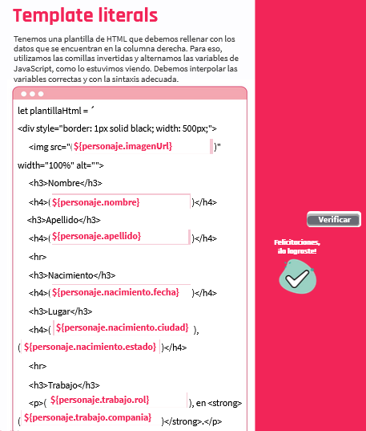
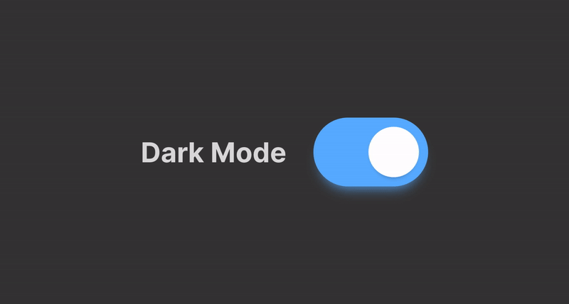
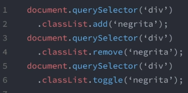

<link rel="stylesheet" type="text/css" media="all" href="./styles.css" />

<t>Front End II</t>

---

## Índice

1. Bienvenida e Introducción a Javascript Front

-   [C1 - Bienvenida](#c1)
    -   [Introducción a la materia](#c1a)
    -   [Origen de JavaScript](#c1b)
    -   [DevTools: Consola](#c1c)
    -   [console.log()](#c1z)
    -   [alert()](#c1y)
    -   [Vinculando HTML y JavaScript](#c1s)
-   [C2 - Introducción a JavaScript Front](#c2)
    -   [Capturando datos del cliente](#c2a)
        -   [prompt()](#c2a1)
        -   [confirm()](#c2a2)
    -   [Manipulando datos](#c2b)
        -   [ParseInt()](#c2b1)
        -   [ParseFloat()](#c2b2)
        -   [Math()](#c2b3)
    -   [Bucles específicos](#c2c)
        -   [for in](#c2c1)
        -   [for of](#c2c2)
    - [Notas clase 2](#c2s)
    -   [Juego: Piedra papel o tijera - Nivel I](#c2s1)
        -   [Solución: Juego Nivel I](#c2s1a)
-   [C3 - Repaso](#c3)
    -   [Juego: Piedra papel o tijera - Nivel II](#c3s1)
    -   [Solución: Juego Nivel II](#c3s1a)

2. Manipulacion del DOM
-   [C4 - Introducción al DOM](#c4)
    -   [Objeto window y document](#c4a)
        -   [window](#c4a1)
        -   [document](#c4a2)
        -   [Quiz + repaso](#c4a3)
    -   [Seleccionando elementos](#c4b)
        -   [.querySelector](#c4b1)
        -   [.querySelectorAll](#c4b2)
        -   [Selectores del DOM](#c4b3)
        -   [Comparando selectores](#c4b4)
- [C5 - Modificando elementos con Javascript](#c5)
    - [Modificando el DOM](#c5a)
    - [Plantillas de texto / template literals](#c5b)
    - [Modificando estilos](#c5c)
    - [Modificando clases](#c5d)


# C1 - Introducción <a id='c1'></a>

[Módulos de Front End](https://view.genial.ly/60ab9dbe27391f0d8711d89a) <a id='c1a'></a>

## Origen de Javascript <a id='c1b'></a>

> Ver video: Conociendo Javascript

<!-- inicio resumen video -->

Primero llamado _Mocha_, luego _LiveScript_ luego **_Javascript_**


### Cronologia


### Evolución Javascript


<!-- Fin resumen video -->

> ver repaso PDF: repaso-javascript

---

## Conociendo la consola del navegador <a id='c1c'></a>

> Ver pdf: devtools

<!-- Inicio resumen pdf -->

La consola es una herramienta que tenemos los desarrolladores en el navegador para tomar decisiones sobre nuestro proyecto al mismo tiempo que es interpretado por Chrome.

¿qué podemos hacer con ella?Cuando algo no funciona como queremos, podemos pasar mucho tiempo intentando descubrir cuál es el problema y arreglarlo. Por eso, la consola nos sirve para agilizar este proceso porque nos señala qué ocurre cuando ejecutamos una tarea o petición al servidor. Puede ser que nos devuelva el dato que buscábamos, un error o un aviso (warning). A este proceso se lo llamadepurar el código o debugging.

**Elements y Styles**

En la pestaña Elements veremos el código HTML y en Styles, nuestro CSS. Si hacemos clic en la flecha indicada en la imagen y luego, colocamos el mouse sobre los elementos en pantalla, nos daremos cuenta fácilmente dónde se encuentran en el código para poder manipularlos y apreciar el cambio sin tener que ir al editor de texto y guardar.

## Tipos de errores

Existen varios tipos de errores, en la consola se muestran en color rojo. Por ahora, los más comunes que vamos a conocer son:

-   **SyntaxError**: Representa un error de sintaxis en el lenguaje representado en JavaScript.
-   **TypeError**: Representa un error que ocurre cuando una variable o parámetro no es de un tipo válido, es decir, `undefined`.

## Responsive

Muchas veces necesitamos adaptar nuestra web para poder visualizarlas correctamente en distintos dispositivos. En la parte superior del inspector hay un icono de dispositivo, al hacer clic podemos determinar la resolución de pantalla o, directamente elegir un dispositivo.

## Application

Con la pestaña Application podremos ejecutar tareas respecto a los datos que se guardan por el cliente en nuestra web por cierta cantidad de tiempo. Como, por ejemplo, borrar de la memoria los datos ingresados en el login de un usuario.

_Lighthouse_ es una herramienta que genera reportes para comprobar ciertos recursos que debe tener la web para que sea óptima. Algunos de ellos son:

-   performance,
-   accesibilidad y
-   SEO.

<!-- fin resumen pdf -->

> Ver PDF: Javascript: Baby steps

<!-- inicio resumen pdf -->

## Primeros pasos en JavaScript

### `console.log()` <a id='c1z'></a>

Ahora que conocemos la consola como parte de las herramientas que debemos utilizar al desarrollar, pongamos en práctica algunas líneas de código.

Lo clásico sería mostrar un mensaje por consola, para eso, debemos implementar el método `log()` del objeto `Console`. Entonces, ¿cómo sería?

```javascript
console.log("Esto es un mensaje por consola");
```

Podemos probar ejecutar la misma sentencia con diferentes mensajes, incluso con
distintos tipos de datos y deberíamos tener el mismo resultado. Por ejemplo:

```javascript
console.log("Hola, soy otro texto");
console.log(25);
console.log(true);
```

**Variantes**

Como alternativas al .log() —pero rara vez implementadas— está bueno saber que
existen otros métodos como:

`.error()` Escribe un error en consola

`.warn()` Escribe una advertencia en consola

`.table()` Escribe una tabla en consola

```javascript
let miObjeto = {
    mensaje: "Mensaje de texto",
    utilidad: "prueba de JS",
};

let miArray = ["Primer mensaje del array", "Segundo mensaje del array", "Tercer mensaje del array"];

console.table(miObjeto);
console.table(miArray);
```

Sigamos probando alternativas, familiarizándonos con la consola del navegador e
implementemos código para obtener distintos resultados.
**También podemos realizar operaciones aritméticas y relacionales.**

```javascript
let numero = 5;
let numeroEnLetras = "5";

console.log(numero == numeroEnLetras);
console.log(numero === numeroEnLetras);
```

### `alert()` <a id='c1y'></a>

Así como mostramos mensajes por consola, los cuales son muy útiles para debbuggear nuestro código, también tenemos mensajes de alerta que puede ver el
usuario.
El método `alert()` pertenece al objeto `window`, pero para utilizar podemos
directamente implementarlo en la consola.

```javascript
alert("Esto es una alerta");
```

El método muestra una caja de alerta con el mensaje que le pasamos por parámetro y un botón de OK. Justamente es implementado para mostrarle al usuario cierta información que creamos importante. De esta manera simple y rápida ya podemos comunicarnos con el usuario.

No se trata de la interfaz más bonita del mundo, pero al menos así podemos mostrar
un cartel inevitable a la vista.

**Quiz**

¿Qué combinación de teclas abre la consola del navegador?
Ctrl, Shift + I
¡Correcto! Además de F12, podemos utilizar la combinación Ctrl, Shift + I

Puedo crear una variable directamente en la consola.
Verdadero

La consola solo es visible para los usuarios que están logueados.
Falso

A través de la consola puedo modificar páginas web.
Verdadero

¿Cuál es la función principal de la consola?
Depurar páginas web.

¿Puedo activar o desactivar la consola en mi sitio web?
Jamás, es una herramienta del navegador.

Al cerrar la consola pierdo todos los cambios que realicé en la misma.
Falso
¡Correcto! Las variables se mantienen hasta que se cierre o cambie de página el sitio.

<!-- inicio pdf clase sincrónica c1 -->

> Ver pdf: Vinculando HTML y JavaScript.pdf

## Vinculando HTML y JavaScript <a id='c1s'></a>

### Vinculación interna

Nos permite escribir código JavaScript directamente en nuestro archivo HTML. Sin embargo, esta no es la forma más prolija de trabajar.

```javascript
<body>
    <script>console.log(“HolaMundo!”);</script>
</body>
```

### Vinculación externa

Nos permite linkear nuestro archivo HTML con un archivo JavaScript externo

```javascript
<body>
    <script src="js/main.js"> </script>
</body>
```

Recordemos que, con el uso de la vinculación externa, no es necesario escribir las etiquetas `<script>` dentro de nuestro archivo con extensión **.js**

```javascript
let saludo = "Hola mundo!";

console.log(saludo);
```

<!-- fin pdf clase sincrónica -->

# C2 - Introducción a javaScript Front <a id='c2'></a>

## Capturando datos del cliente <a id='c2a'></a>

> Ver video: Capturando datos del cliente

Como vimos anteriormente, JavaScript en el navegador nos provee de ciertos objetos y métodos que podemos aplicar con un simple llamado a los mismos. Para continuar utilizando métodos de Window, podemos sumar otros que le permiten al usuario ingresar información, la cual podemos captar y utilizar en nuestros programas.

```javascript
alert("Esto es un alerta");
```

> Ver PDF: alert(), prompt(), confirm().pdf

## prompt() <a id='c2a1'></a>

Uno de ellos es el prompt(), este muestra un cuadro de diálogo con mensaje opcional, que solicita al usuario que introduzca un texto. Además tiene dos opciones: “Aceptar” o “Cancelar”.

```javascript
prompt("Ingresa nombre completo");
//Usuario ingresa contenido que queda tipo string

console.log(prompt("Ingresa nombre completo"));
//Muestra por consola lo que ingreso el usuario, de lo contrario es null
```

Por el momento ese dato se pierde, pero si lo almacenamos en un variable podremos utilizarlo para el resto de nuestro programa. Hagamos esa prueba.

```javascript
let nombreUsuario = prompt("Por favor, introduzca su nombre");
console.log(nombreUsuario);
```

> Al utilizar un espacio en memoria para guardar este dato, podremos utilizarlo como información. En el caso de que el usuario seleccione “Cancelar”, el resultado que nos retorna es null. En cambio, si el usuario presiona “Aceptar” sin completar nada, nos devolverá un texto vacío. Probemos también este caso y veamos el resultado.

## confirm() <a id='c2a2'></a>

El método `confirm()`muestra un cuadro de diálogo con un mensaje opcional y dos botones, “Aceptar” y “Cancelar”. En este caso, lo que nos <r>permite es ingresar alguna pregunta o indicación al usuario</r> para que este responda por sí o no únicamente. El valor que nos va a retornar es un booleano indicando `true` si pulsamos Aceptar y `false` si elegimos Cancelar.

```javascript
confirm("Esto pregunta y pide aceptar o cancelar");

console.log(confirm("acepta o cancela"));
// Devuelve true o false por consola
```

Recordemos que por sí solo el método no almacena ningún dato, pero si almacenamos el valor retornado en una variable, lo podremos utilizar como información. Hagamos la prueba de combinar ambos métodos en algo más funcional.

```javascript
let tratoPersonalizado = confirm("¿Desea un trato personalizado?");

if (tratoPersonalizado) {
    let nombre = prompt("Por favor, introduzca su nombre");
    alert("Le damos la bienvenida a nuestro sitio " + nombre + ". ¡Muchas gracias por visitarnos, estamos a su disposición!");
} else {
    alert("Gracias por conectarse.");
}
```

Ahora sí podemos ir viendo cómo tiene más sentido implementar los métodos, pero de manera conjunta para lograr un resultado más complejo. O por lo menos guardar esos datos y utilizarlos cuando lo creamos conveniente.

**Quiz**

Un modal es una pequeña ventana con la que el usuario interactúa y no desaparece hasta que presiona “OK” o “Aceptar”.
Verdadero

¿Qué método de window usamos en JavaScript para que el usuario ingrese datos por teclado?
`prompt()`

¿Cuál es la diferencia entre alert y confirm?
Con alert hay un botón para aceptar que el mensaje fue recibido, confirm hace una consulta al usuario y este decide por “Aceptar” o “Cancelar”.
¡Correcto! Con ambos métodos se utilizan botones y la ventana del modal no desaparece hasta pulsarlos. En el caso de alert, solo se podrá presionar “Aceptar” mientras que con confirm, nos aseguramos que el usuario decida por sí o por no, es decir, “Aceptar” o “Cancelar”.

Si no completo un dato en prompt y pulso “Aceptar”, retorna por defecto una cadena de texto vacío.
Verdadero
¡Correcto! El valor por defecto siempre será una cadena de texto en caso de “Aceptar” y null en caso de “Cancelar”.

Los datos obtenidos con cualquiera de los métodos de window se almacenan automáticamente y se visualizan en consola.
Falso
¡Correcto! Los datos se pierden si no son almacenados en una variable.

¿Qué retorna un prompt() si el usuario presiona “Cancelar”?
`null`
¡Correcto! El valor por defecto de la opción “Cancelar” es null, es decir, nulo o vacío. Que no existe. A diferencia de undefined, que existe, pero no está definido.

¿Qué tipo de dato almacena un confirm()?
booleano
¡Correcto! Porque “Aceptar” es verdadero (Sí) y Cancelar es falso (No).

---

## Manipulando datos <a id='c2b'></a>

**PARSEANDO**

Como vimos, los resultados de los valores obtenidos con el método `prompt()` no
siempre coinciden con el tipo de dato que necesitamos. Es decir, si le pedimos al
usuario que ingrese su edad y la guardamos en una variable para usar la misma y
sumársela al año actual, veremos que no obtenemos el resultado pretendido. 😐

```javascript
let edad = prompt("ingrese su edad");
console.log(edad + 2021);
```

Está claro que si a un texto le sumamos un número no obtendremos la sumatoria,
sino que tendremos la concatenación de ambos como un texto.

## `parseInt()` <a id='c2b1'></a>

Para no incurrir en errores como el anterior u otros tantos que pueden surgir de no comprobar el tipo de dato que estamos manipulando tenemos la función `parseInt()`. <r>Esta función parsea una cadena de texto y **devuelve un número**.</r>

```javascript
parseInt("22");
parseInt(prompt("Ingrese edad"));
```

De nuevo a lo de siempre, si no guardamos estos datos en ningún lado, difícilmente podamos hacer algo con ellos. Para eso, implementamos variables que almacenan el resultado de las funciones. Veamos su resultado.

```javascript
let a = parseInt("22");
let b = parseInt(prompt("Ingrese edad"));
let c = parseInt("22" + "150");
let d = parseInt(22 + 150);
let e = parseInt(22 + parseInt("150"));
let f = parseInt(22.55);
console.log(a); //22
console.log(b); //30
console.log(c); //22150
console.log(d); //172
console.log(e); //172
console.log(f); //22

//devuelve números
```

Al combinar y probar distintas posibilidades obtendremos distintos resultados, lo
fundamental es entender el funcionamiento de cada método y función para aplicarlo
según nuestras necesidades. Como vemos, en un caso puntual observamos que la
función `parseInt()` solo nos devuelve la parte entera del número que ingresemos, por lo que <r>si tenemos decimales los mismo quedarán truncados</r>.

## `parseFloat()` <a id='c2b2'></a>

Acá entra en juego esta otra función, que tiene el mismo objetivo que la anterior, pero en este caso si nos retorna los números decimales que existan.

```javascript
console.log(parseFloat(22.34));
console.log(parseFloat(22.3456284));
```

> Si fuimos probando estas funciones y además por curiosidad, o error —ambos son sumamente útiles🙂—, intentamos parsear un texto, vimos que el resultado obtenido no es un número.

## `NaN`

La propiedad `NaN` nos indica que el valor no es un número _(Not A Number)_, por lo que esto nos produciría un error si queremos realizar alguna operación aritmética con este valor.
Pongamos este ejemplo de una situación que nos produciría un error.
Supongamos que en el siguiente código, al ejecutarse, en el cuadro de
diálogo del prompt el usuario, por error o a propósito —cosa que
debemos tener en cuenta como programadores🧐—, ingresa un texto
“su edad”.

```javascript
let edad = parseInt(prompt("Ingrese su edad"));
if (edad > 18) {
    console.log("Es mayor de edad");
} else {
    console.log("Es menor de edad");
}
```

> 🚨Claramente no estamos exentos de que el usuario sea un [troll](<https://es.wikipedia.org/wiki/Trol_(Internet)>), por eso, siempre tenemos que buscar maneras de validar los datos que el usuario puede manipular.

**Desafio**

Te invitamos a resolver el siguiente desafío para seguir practicando. Para ello,
podés abrir el VS Code y pegar el último bloque de código implementado.

-   ¿Cuál es el resultado de este código?
-   ¿Es correcto lo que arroja en base a lo que ingresó el usuario?
-   ¿Dónde podría existir un problema?
-   ¿Cómo podríamos solucionarlo y llegar a un mejor resultado utilizando los
    métodos que ya conocemos? → Tip
    🎈Animate a refactorizar el código, pensar en los posibles errores y cómo salvarlos.

→ Tip: Tenemos la función `isNaN()`, la cual nos devuelve `true` si el valor dado como parámetro es NaN. Para conocer más podés ingresar [acá](https://developer.mozilla.org/es/docs/Web/JavaScript/Reference/Global_Objects/isNaN).

**Resolución**

```javascript
let edad = parseInt(prompt("Ingrese su edad"));

if (isNaN(edad)) {
    console.log("No es un numero");
} else if (edad > 18) {
    console.log("Es mayor de edad");
} else {
    console.log("Es menor de edad");
}
```

**EXTRA**

## Math() <a id='c2b3'></a>

Como un apartado de esta sección, traemos para revisar información de un objeto
que quizás nos sirva en algún momento de nuestro desarrollo. Estamos hablando de
[Math](https://developer.mozilla.org/es/docs/Web/JavaScript/Reference/Global_Objects/Math), que consta de muchísimas propiedades y métodos que nos pueden ser de
utilidad.

> Ver PDF: Math.pdf

<!-- resumen math -->

> ¿Para qué crear algo que ya existe y resuelve el problema por nosotros?

**Objetos incorporados en JavaScript**

Cuando hablamos de objetos incorporados, nos referimos a “cosas ya inventadas”. En referencia a la frase anterior, la respuesta puede variar, pero si existe una función o método que resuelve un problema típico, podemos recurrir a eso. No siempre es necesario crear una nueva solución, podemos implementar las disponibles.Justamente el objeto Math es uno de los casos porque tiene propiedades y métodos para constantes y funciones matemáticas.

**Propiedades**

Rara vez implementaremos alguna de las propiedades, pero estas se encuentran todas más que disponibles.

Por poner un ejemplo, podemos utilizar la propiedad que nos devuelve PI.

```javascript
Math.PI; //3.141592653589793
```

> En total son 8 constantes matemáticas a las que se puede acceder.

**Métodos**

Estos son funciones matemáticas que ya conocemos, se utilizan diariamente para realizar cálculos. Algunas de ellas son:

| Método           | Función                                                                       |
| ---------------- | ----------------------------------------------------------------------------- |
| `Math.random();` | Retorna un punto flotante, un número pseudoaleatorio dentro del rango [0, 1). |
| `Math.round();`  | Retorna el valor de un número redondeado al entero más cercano.               |
| `Math.max();`    | Devuelve el mayor de cero o más números.                                      |

> ver mas [metodos aquí](https://developer.mozilla.org/es/docs/Web/JavaScript/Reference/Global_Objects/Math#propiedades)

**Ejemplos**

`Math.random()`

Obtiene un número aleatorio basado en un algoritmo.

-   **No recibe parámetros.**
-   **Retorna** un punto flotante, un número pseudoaleatorio dentro del rango [0, 1). Desde el 0 (Incluido) hasta el 1, pero sin incluirlo (excluido).

```javascript
let randomSimple = Math.random(); // 0.049253517516472556
let randomEscalado = Math.random() * (100 - 1) + 1; // 86.5806550233727
parseInt(randomEscalado); // 86
```

`Math.round()`

Devuelve el valor del número dado redondeado al entero más cercano.

-   **Recibe** un número, idealmente con punto flotante (float).
-   **Retorna** el valor del número dado redondeado al entero más cercano.

```javascript
let num = Math.round(20.49); // 20
let aleatorio = Math.random() * (100 - 1) + 1; // 86.5806550233727
Math.round(aleatorio); // 87
```

`Math.max()`

-   **Recibe** un conjunto de números.
-   **Retorna** el mayor de cero o más números.

> Si al menos uno de los argumentos no puede ser convertido a número, el resultado es `NaN`.

```javascript
let numUno = Math.max(10, 20);   //  20
let numDos = Math.max(10, 20, 30.58);   //  30.58
let numTres = Math.max(10, 20, 30.58, “No”);   //  NaN
```

<!-- fin resumen pdf -->

[Juego: Piedra papel o tijera con Math()](https://view.genial.ly/60a68f844000a90d34ab3be5)

<!-- imágenes c2b1 al c2b7 -->

## Bucles específicos <a id='c2c'></a>

> Ver video: Bucles específicos

Los bucles o loops son una gran herramienta para poder recorrer elementos iterables. Sumemos algunas opciones más a las que ya conocemos.

### `for in` <a id='c2c1'></a>

Solo itera sobre objetos literales
necesitamos un objeto sobre el cual iterar por ejemplo _persona_

```javascript
let persona = {
    nombre: "Liliana Ospina",
    edad: 30,
    profesion: "Programadora",
};
// palabra reservada for, parentesis y llaves, dentro de los parentesis declaramos unas variable cualquiera seguido de in mencionamos el objeto que deseemos iterar
for (let caracteristica in persona) {
    //aquí podemos el código que va a iterar
    //la variable característica toma las propiedades del objeto, no sus valores
    //si usamos en el console log el objeto y en corchetes la variable, traerá los valores de cada propiedad
    console.log(persona[caracteristica]);
}
```


## `for of` <a id='c2c2'></a>

Lo usaremos para iterar sobre arrays
necesitamos un array sobre el cual iterar
también nos servira para iterar sobre cadenas de texto
La sintaxis es parecida a la de `for in`

```javascript
let series = ["Friends", "Game of thrones", "Breaking Bad"];

for (let unaSerie of series) {
    console.log(unaSerie);
}
```


> ver PDF: Bucles específicos.pdf

<!-- resumen pdf -->

Las sentencias de Javascript for...in y for...of nos van a permitir iterar elementos usando una sintaxis clara y sencilla.

### Estructura for in

Estructura del for...in El bucle for...in nos permite iterar sobre cada una de las propiedades de un objeto

**for in**


### Estructura for of

**for of**

El bucle for...of nos permite iterar sobre cada uno de los valores de un elemento iterable, por ejemplo, un array


## Notas Clase 2 <a id='c2s'></a>

```javascript
parseInt(Math.random() * 3 + 1);
// Permite redonear, parseInt se queda con la parte entera del numero
```

> Ver código ejemplos: `for in` y `for of` en practica.js

<!-- juego piedra papel o tijera -->

## Juego: Piedra papel o tijera - Nivel I <a id='c2s1'></a>

con el método y funcion `math.random()` retorna un valor aleatorio entre 0 y 1 `[0,1)`

> Información dice que el valor no es realmente aleatorio, ya que esta basado en un algoritmo que toma como semilla el valor del el reloj de la computadora.
> para que me de un numero entre un numero especifico:

```javascript
Math.random() * 3;
//Esto me dará valores entre 0 y 3
```

para hacerlo mas acorde a un numero y que no salga el `0`

```javascript
Math.random() * 3 + 1;
//Esto da números aleatorios entre 1 y 3
```

para obtener el numero que necesito; quedandome con el entero puedo usar `parseInt`

```javascript
parseInt(Math.random() * 3 + 1);
//Toma el entero del Math.random()
```

para pedir la elección del jugador usamos `prompt()`

```javascript
const usuario = parseInt(prompt(`Ingrese 1 para piedra, 2 para papel, 3 tijera`));
//Uso el parseInt para que pase el String que devuelve el prompt a int
```

<!-- min 55 condicionales -->

**Solución: Juego Nivel I** <a id='c2s1a'></a>

```javascript
const computadora = parseInt(Math.random() * 3 + 1);

const usuario = parseInt(prompt("Ingrese 1 para piedra, 2 para papel o 3 para tijera."));

let resultado = "Sin resultado aun";

// lógica del juego
//si el usuario selecciona piedra
if (usuario == 1) {
    if (computadora == 1) {
        resultado = "Empate";
    }
    if (computadora == 2) {
        resultado = "Derrota!😑";
    }
    if (computadora == 3) {
        resultado = "Triunfo!😎";
    }
}

// si el usuario elige papel
if (usuario == 2) {
    if (computadora == 1) {
        resultado = "Triunfo!😎";
    }
    if (computadora == 2) {
        resultado = "Empate";
    }
    if (computadora == 3) {
        resultado = "Derrota!😑";
    }
}
// si el usuario elige tijera
if (usuario == 3) {
    if (computadora == 1) {
        resultado = "Derrota!😑";
    }
    if (computadora == 2) {
        resultado = "Triunfo!😎";
    }
    if (computadora == 3) {
        resultado = "Empate";
    }
}

alert("El resultado de la partida fue: " + resultado);
```

## Notas - Clase 3\*\* <a id='c3'></a>

## Juego: Piedra papel o tijera - Nivel II <a id='c3s1'></a>

Refactorizando el código, pensarlo en momentos clave, dentro de los momentos mejorar procesos.

Implementar funciones y reutilizarlas:

```javascript
function jugadaComputadora() {
    return parseInt(Math.random() * 3 + 1);
}
// Modularizamos el llamado de un numero aleatorio entre 1 y 3
```

otro momento es la jugada del usuario.
Por ahora no recibiría parametro, pero podria usar un `prompt` para recibir por parametro el ingreso del numero por parte del usuario

```javascript
function jugadaUsuario() {
    //2. definimos la variable
    let usuario;

    //4. Necesitamos una estructura que pregunte mínimamente una vez, si responde bien, puede salir, si no, sigue en la misma situación.
    do {
        //3. parsea el ingreso del usuario ---> 5.la muevo al do while
        usuario = parseInt(prompt("Ingrese 1 para piedra, 2 para papel o 3 para tijera."));
        //hago la comparacion: Lo dejo salir si cumple con condición para que la jugada sea valida: del 1 al 3, que sea numero,
    } while (usuario < 1 || usuario > 3 || isNaN(usuario));

    //1.devolveremos la jugada del usuario
    return usuario;
}
```

Otro momento son las comparaciones de las jugadas
Recibe las jugadas de pc y usuario por parametro, valores que serán entre 1 y 3 y devolverá el resultado de la jugada para saber quien gano

```javascript

function comparacionJugada(user,pc) {
    let resultado;
    //hay 3 posibilidades de resultados
    if (user == pc) {
        resultado = "Empate";
        //en el else if se definen escenarios donde ganaria el usuario
    }else if ((user==1 && pc==3) || (user==2 && pc==1) || (user==3 && pc=2)) {
        resultado = "usuario"
        //si ya hay empate y donde gana el usuario, en el else seria el tercer caso; las que quedan, donde gana la pc.
    } else {
        resultado = "computadora"
    }
    //Devuelve el resultado.
    return resultado;
}

```

Ahora vemos como lo ejecutamos creando el programa principal

```javascript
//Podemos crear constantes para los mensajes
const MSJ_EMPATE = "Empate!";
const MSJ_TRIUNFO = "Triunfo!";
const MSJ_DERROTA = "Derrota!";

//Que el programa haga una jugada
let computadora = jugadaComputadora();
//Pide a jugador su jugada
let jugador = jugadaUsuario();

//Procede a la comparacion de jugadas.
comparacionJugada(jugador, computadora);
```

Crearemos los puntajes, almacenara los puntajes, gana el que gane 2 partidas, gana.

```javascript
//crearemos un objeto
const puntajes = {
    usuario: 0,
    computadora: 0,
};

//según lo que venga de resultado, la guardamos en una variable para que quede mas legible
let partida = comparacionJugada(jugador, computadora);

//sumamos un punto en el contador
if (partida == "usuario") {
    puntajes.usuario++;
} else if ((partida = "computadora")) {
    puntajes.computadora++;
}
//Muestra por consola en formato tabla los puntajes en cada partida
console.table(puntajes);
```

Hacer que el programa se repita hasta que alguno de los usuarios llegue a los 2 puntos:

```javascript
let juego = true;
//usamos ciclo while puede ser for
//Se van a jugar partidas hasta que un jugador llegue a 2 puntos
while (juego) {
    //pero el juego
    let computadora = jugadaComputadora();
    let jugador = jugadaUsuario();
    let partida = comparacionJugada(jugador, computadora);

    if (partida == "usuario") {
        puntajes.usuario++;
    } else if ((partida = "computadora")) {
        puntajes.computadora++;
    }

    //evaluamos si alguien llego a los 2 puntos, si fue asi se apaga el juego
    if (puntajes.usuario > 1 || puntajes.computadora > 1) {
        juego = false;
    }
}
```

> `while` corta cuando encuentra la condición, `for` sigue iterando a menos que se haga `return` pero no es buena practica poner muchos return en funciones.

podemos cambiar la condición de `while` por:

```javascript
while (puntajes.usuario < 2 && puntajes.computadora < 2) {
    //pero el juego
    let computadora = jugadaComputadora();
    let jugador = jugadaUsuario();
    let partida = comparacionJugada(jugador, computadora);

    if (partida == "usuario") {
        puntajes.usuario++;
    } else if ((partida = "computadora")) {
        puntajes.computadora++;
    }
}
```

usamos los mensajes según las partidas

```javascript
//Creo alertas y uso los mensajes en la funcion
function comparacionJugada(user,pc) {

    let resultado;

    if (user == pc) {
        resultado = "Empate";
        alert("Esta partida fue: "+MSJ_EMPATE)
    }else if ((user==1 && pc==3) || (user==2 && pc==1) || (user==3 && pc=2)) {
        resultado = "usuario"
        alert("Esta partida fue: "+MSJ_TRIUNFO)
    } else {
        resultado = "computadora"
        alert("Esta partida fue: "+MSJ_DERROTA)
    }
    return resultado;
}

```

Vemos quien es el ganador

```javascript
if (puntajes.usuario > puntajes.computadora) {
    alert("EL RESULTADO GLOBAL FUE UN TRIUNFO");
} else {
    alert("EL RESULTADO GLOBAL FUE UNA DERROTA");
}
```

**Solución: Juego Nivel II** <a id='c3s1a'></a>

```javascript
/* ---------------------- JUEGO --------------------------- */
const MSJ_EMPATE = "Empate!";
const MSJ_TRIUNFO = "Triunfo!😎";
const MSJ_DERROTA = "Derrota!😑";

const puntajes = {
    usuario: 0,
    computadora: 0,
};

//se van a jugar partidas hasta que un jugador llegue a 2 puntos
while (puntajes.usuario < 2 && puntajes.computadora < 2) {
    let computadora = jugadaComputadora();

    let jugador = jugadaUsuario();

    let partida = comparacionJugada(jugador, computadora);

    //sumatoria de puntos
    if (partida == "usuario") {
        puntajes.usuario++;
    } else if (partida == "computadora") {
        puntajes.computadora++;
    }
    console.table(puntajes);
}

if (puntajes.usuario > puntajes.computadora) {
    alert("EL RESULTADO GLOBAL FUE UN TRIUNFO");
} else {
    alert("EL RESULTADO GLOBAL FUE UNA DERROTA");
}

/* -------------------- FUNCIONES ----------------- */
function jugadaComputadora() {
    return parseInt(Math.random() * 3 + 1);
}

function jugadaUsuario() {
    let usuario;

    do {
        usuario = parseInt(prompt("Ingrese 1 para piedra, 2 para papel o 3 para tijera."));
    } while (usuario < 1 || usuario > 3 || isNaN(usuario));

    return usuario;
}

function comparacionJugada(user, pc) {
    let resultado;

    if (user == pc) {
        resultado = "empate";
        alert("Esta partida fue: " + MSJ_EMPATE);
    } else if ((user == 1 && pc == 3) || (user == 2 && pc == 1) || (user == 3 && pc == 2)) {
        resultado = "usuario";
        alert("Esta partida fue: " + MSJ_TRIUNFO);
    } else {
        resultado = "computadora";
        alert("Esta partida fue: " + MSJ_DERROTA);
    }

    return resultado;
}
```

<!-- fin notas clase 3 sincrónica -->

# C4 - Introducción al DOM <a id='c4'></a>

## Objeto window y document <a id='c4a'></a>

_window y document_, ¿no son acaso lo mismo? Si nos apegamos a la descripción literal de la página de Mozilla, podremos decir que:

> **El objeto window** Representa la ventana que contiene al documento y **el objeto document** Representa al DOM (documento HTML) cargado en esa ventana”.

Hay que recordar que el DOM (document object model) representa al documento que se carga en el navegador como un árbol de nodos, en donde cada nodo representa una parte del documento.

Veamos esto en un ejemplo:



Esta es la representación que JavaScript le da a un documento HTML con su estructura habitual que contiene dentro del body un elemento `<h1>` y un elemento `<p>`.

> En resumen, `window` y `document` es la manera en la que JavaScript nos da acceso a los elementos presentes en el documento HTML para que a través de estas funcionalidades podamos manipular el contenido según nuestro criterio y necesidades.

> Ver video: El objeto window y document

<!-- resumen video y link -->

`window` la ventana, el navegador



`document` DOM Document Object Model
document nos da propiedades y metodos para interactuar con el DOM

> window y document son nativos de javascript es decir que no tengo que almacenarlos en variables.

<!-- fin resumen video -->

[Link interactivo: objetos window y document](https://view.genial.ly/604946dc874b210da1260206)

<!-- resumen link y video inicio -->

## Introducción: qué son los objetos Window y Document

Window y Document son dos objetos mediante los cuales podremos manipular la interfaz que interactúa con el usuario, sin tener que hacer peticiones al servidor y devolverlas al usuario. Al interactuar con estos dos objetos, vamos a notar que la página no se recarga, ya que lo que se modifica es la interfaz


## Window <a id='c4a1'></a>

Sirve para trabajar con la **ventana** del navegador

-   El objeto **Window**, como bien lo indica su nombre, se refiere a toda la ventana que vemos en el navegador.
-   Este se utiliza principalmente para manipular la ventana. Algunas de las funciones más conocidas y comúnmente utilizadas del objeto Window pueden ser:
    -   `window.location` → Retorna un objeto con los detalles de la URL, la ruta, el href, etc.
    -   `window.height y window.width` → Retorna la altura y/o el ancho de la pantalla actual de la ventana.

```js
//alto de ventana
window.innerHeight;
//retorna ej 720
//ancho de ventana
window.innerWidth;
//retorna ej 650
window.innerWidth = 300;
//300
window.innerWith;
//300

//Podemos saber el host donde estamos, el nombre, ubicación, protocolo, path
window.location;
//Puedo pisar los datos
window.location.href = "http://noticias.com";
```

## Document <a id='c4a2'></a>

Esto permite interactuar con el documento dentro del navegador, con el **contenido** del documento

-   A diferencia del Window, el objeto Document se utiliza para leer y modificar, si así lo deseamos, el contenido de la ventana. Por ejemplo, lo podríamos usar para modificar nuestro HTML a través de sus clases y estilos.
-   Solemos llamar al objeto Document: DOM (Document Object Model) y, como se ve en el diagrama, se encuentra dentro del objeto Window. Para acceder a él y todos sus métodos, deberíamos hacerlo de la siguiente manera:
    -   `window.document.title` → Retorna el título del documento sobre el que estamos navegando.
-   Sin embargo, JS Front nos permite abreviarlo así:
    -   `document.title`

```js
//cambiar el color de fondo
document.bgColor = "red";
//cambia el color de fondo a red

//retorna array con todas las hojas de estilo vinculadas
document.styleSheets;

document.styleSheets[0];
//siendo un array ingreso con la posición
```

### Divs

Los Divs son componentes de nuestro HTML que pueden ser modificados y manipulados a través del uso del objeto Document.

<!-- fin resumen video y link -->

## Buenas prácticas

Si bien repasamos en líneas generales las funciones y los métodos más utilizados de los objetos window y document, no hay que dejar de explorar todas sus bondades. En estos links podemos acceder a la documentación y encontrar todo lo que podemos crear con JavaScript desde el front end: window y document.

**Quiz** <a id='c4a3'></a>

JavaScript nos permite interactuar con el front-end del usuario siempre y cuando se haga una petición al servidor.
Falso

¿Qué es el DOM?
La representación en objetos que hace JavaScript del documento HTML.

El objeto window representa la ventana donde estamos navegando.
verdadero

Mediante el objeto document podemos...
Leer todos los elementos del HTML y modificarlos, si así lo quisiéramos.


## Seleccionando elementos <a id='c4b'></a>

> Ver video: Seleccionando elementos

<!-- resumen video -->

Cuando queremos modificar que queremos modificar del contenido html

## .querySelector() <a id='c4b1'></a>

Este selector recibe un string que indica el selector CSS del elemento del DOM que estamos buscando.
Método que permite determinar donde queremos hacer el cambio.

> Es importante declarar una variable para almacenar el dato que nos traiga el selector, ya que de otra manera lo perderíamos al continuar la ejecución del programa.

```js
//etiqueta html
document.querySelector("form");
//etiqueta html con clase
document.querySelector("form.registracion");
//etiqueta con id
document.querySelector("form#unico");
//clase
document.querySelector(".especial");
```

retornara la etiqueta que estemos buscando, si la clase esta en muchas ubicaciones, devolverá la primera que haga match

## .querySelectorAll() <a id='c4b2'></a>

Devuelve todas las etiquetas que macheen con las etiquetas que le haya indicado, devolviendo una lista de nodos que podemos trabajar como un array

```js
//Devuelve todas etiquetas que macheen con .especial
document.querySelectorAll(".especial");
```

> Siempre que le pedimos a javascript que capture algo y no exista devolverá `null`

Podemos recorrer los párrafos usando `for of`

```js
let losParrafos = document.querySelector("p");

//De losParrafos dame un párrafo
for (const unParrafo of losParrafos) {
    console.log(unPárrafo);
}
//Hace un console.log de todos los Parrafos
```

Si usamos el mismo js para paginas donde no estén los selectores, podemos hacer una simple validación

<!-- min 16:20 -->

```js
//si este selector esta en index y no en contact
let strong = document.querySelector(".parrafo-especial strong");
//hacemos la validación y en contact no sale null
if (strong != null) {
    console.log(strong);
}
```


<!-- fin resumen video -->

> Ver PDF: Selectores del DOM.pdf

<!-- inicio resumen pdf -->

## Selectores del DOM <a id='c4b3'></a>

Para acceder a los elementos de una página, usamos selectores. Cada selector puede retornar un solo elemento o una lista de elementos. Para poder hacer uso de los selectores debemos hacer uso del objeto document, ya que los selectores son métodos del mismo.

## .getElementById()

Este selector recibe un string con únicamente el nombre del id del elemento del DOM que estamos buscando.

Por ejemplo:

```js
let marca = document.getElementById("marca");
//Nos va a retornar el elemento cuyo id coincida con el deseado
```

### Comparando selectores <a id='c4b4'></a>

| querySelector()                                                              | querySelectorAll()                                                             | getElementById()                                               |
| ---------------------------------------------------------------------------- | ------------------------------------------------------------------------------ | -------------------------------------------------------------- |
| Retorna el primer elemento del DOM que cumple con la condición que buscamos. | Retorna todos los elementos del DOM que cumplen con la condición que buscamos. | Retorna el elemento del DOM que cumpla con el id que buscamos. |

<!-- fin resumen pdf -->

# C5 - Modificando elementos con Javascript <a id='c5'></a>

## Modificando el DOM <a id='c5a'></a>

> Ver video: Modificando el DOM

<!-- resumen video -->

### innerHTML

Es una propiedad que te permite ver y/o modificar el HTML de una etiqueta y permite usar contenido html en su contenido.
Si queremos leer o modificar el contenido de una etiqueta HTML, vamos a utilizar esta propiedad.

> Si queremos guardar el valor, debemos asignar esa línea de código a una variable. De otra manera, cuando la ejecución continúe, se perderá el valor que hayamos buscado.

```js
//quiero modificar lo que hay dentro del div
document.querySelector("div");

//innerHTML para leer el contenido o modificarlo
document.querySelector("div").innerHTML;
```

`innerHTML` en caso de ser para escritura, `=` reemplaza completamente el contenido que tuviera antes

```js
document.querySelector("div").innerHTML = "reemplaza";
```

`innerHTML` en caso de ser para escritura, `+=` agrega informacion al final; mantiene lo que tiene anteriormente.

```js
document.querySelector("div").innerHTML += "agrega al final";
```

> Ver min: 0200 ejercicio practico


[Ver mas:](https://www.w3schools.com/js/js_htmldom_nodes.asp)

<!-- fin resumen video -->

> Ver PDF: Modificando el DOM.pdf

<!-- Resumen inicio pdf -->

Para poder hacer modificaciones al DOM siempre tenemos que tener seleccionado el objeto que queremos modificar. Esto lo podemos hacer usando selectores.

### innerText

Si queremos leer o modificar el texto de una etiqueta HTML, vamos a utilizar esta propiedad

```js
document.querySelector("div.nombre").innerText;
```

En este caso, si en mi div con clase nombre estuviera escrito “Leo”, la propiedad me retornaría el string “Leo”.

> Si queremos guardar el valor, debemos asignar esa línea de código a una variable. De otra manera, cuando la ejecución continúe, se perderá el valor que hayamos buscado.

Si queremos modificar el texto de una etiqueta HTML, vamos a utilizar esta propiedad de la siguiente manera:

```js
document.querySelector("div.nombre").innerText = "Maria";
```

Si utilizamos la propiedad de esta forma, todo el texto que teníamos en el div con clase nombre se va a cambiar por el string “Maria”.

> Sin embargo, también podríamos modificar el contenido sin perder lo que teníamos anteriormente..

Si queremos agregar contenido al texto de una etiqueta HTML, vamos a utilizar esta propiedad de la siguiente manera:

```js
document.querySelector("div.nombre").innerText += "Messi";
```

En este caso, lo que sucedería es similar a lo que sucede con el otro selector, pero el texto se incluiría dentro de la etiqueta div, quedando:

```html
<div class="“nombre”">Leo Messi</div>
```

### Propiedad Style

Nos permite leer y sobreescribir las reglas CSS que se aplican sobre un elemento que hayamos seleccionado.

```js
let titulo = document.querySelector(".title");
titulo.style.color = "cyan";
titulo.style.textAlign = "center";
titulo.style.fontSize = "12px";
titulo.style.backgroundColor = "#dddddd";
```

> Nótese que las reglas CSS que llevaban guiones (como font-size), en JavaScript se escriben en camelCase (es decir: fontSize).

<!-- fin resumen pdf -->

## Plantillas de texto / template literals <a id='c5b'></a>

> Ver video: Plantillas de texto



> Ver PDF: template strings

## Sintaxis de un template string



### 📜 Ejemplos!

```js
const nombre= 'Mauro';
const miTemplate = `Mi nombre es ${nombre}`;
console.log(miTemplate) //Mi nombre es mauro
```
```js
const miTemplate =`2 * 3 es ${ 2 * 3 }`;
console.log(miTemplate); //2 * 3 es 6
```
```js
function suma(var1, var2) { 
    return var1 + var2
}
const temp =`El resultado es ${suma(2,2)}`;
console.log(temp); //El resultado es 4
```

> ### 💡
> Como se puede ver, dentro de las llaves se puede ejecutar cualquier código JavaScript, pero es buena costumbre que sea lo más sencillo posible

Ejemplos en html y su js

```html
<html lang="es"> <!-- JS en la siguiente hoja -->
    <head>
        <meta charset="UTF-8">
        <script src="scripts.js"></script>
        <title>Ejemplo</title>
    </head>
        <body id="body">

        </body>
</html>
```
```js
function escribirHTML(titulo, texto) {
    const body= document.getElementById('body');
    const miTemplate= `    
        <h1>${titulo}</h1>    
        <p>${texto}</p>
        `;  
        body.innerHTML+= miTemplate;
        }
        
        escribirHTML('Hola', 'Esto es un ejemplo de template string en html.');
        escribirHTML('Es dinámico', 'Podemos insertar elementos HTML mediante <b>JavaScript</b>');
        escribirHTML('Facilita la programación', 'Evita escribir mucho código y reutilizar el que si escribamos.');
        escribirHTML('En este ejemplo', 'Hemos utilizado una única función para poder escribir 4 veces en HTML, ¿te imaginás lo que sería esto sin esta función?');
```

Supongamos que tenemos un objeto de JavaScript con la siguiente estructura, el cual necesitamos utilizar para rellenar dinámicamente en el front end.

```js
let personaje = {
    nombre: "Michael",
    apellido: "Scott",
    nacimiento: {
        fecha: "15/04/1965",
        ciudad: "Scranton",
        estado: "Pensilvania",
    },
    imagenUrl: "https://upload.wikimedia.org/wikipedia/en/thumb/d/dc/MichaelScott.png/220px-MichaelScott.png",
    trabajo: {
        rol: "manager regional",
        compania: "Dunder Mifflin",
    },
};
```

**Quiz**



## Modificando estilos <a id='c5c'></a>

Con las funcionalidades que nos aporta el DOM de JavaScript, además de poder agregar y modificar el contenido de texto de un elemento presente en el HTML, podemos incluso agregar y eliminar estilos de CSS. Pero ¿bajo qué contextos esto es necesario? Pensemos en algo sencillo, algo como esto:



Esto es bastante común hoy en día. Y es algo bastante sencillo de hacer, pues simplemente, en el momento en el que damos clic en un botón, le estamos pidiendo a JavaScript que agregue o elimine líneas de CSS a un elemento determinado. ¡Y listo, ya está! Sencillo, ¿no? Veamos entonces cómo es posible esta "magia" gracias a JavaScript.

> ver video: Modificando estilos.mp4

<!-- resumen video -->

```js
document.querySelector("p").style.textAlign = center;
```

style = objeto

> En video: uso de confirm() para cambiar estilos, con un if.


<!-- fin resumen video -->

## Styles

A través del DOM, podemos acceder al objeto style que define el estilo de un elemento seleccionado. Por ejemplo, style.color devuelve el color de un elemento y la sintaxis es la siguiente:

```js
element.style.color = "red";
//Otros ejemplos:
element.style.fontSize = "15px";
element.style.backgroundColor = "#FFFFFF";
```

## Modificando clases <a id='c5d'></a>

La propiedad style de los elementos del DOM nos permite agregar líneas de CSS, pero ¿qué pasaría si ese mismo conjunto de estilos los quisiéramos agregar de manera constante? Seguramente, bajo este escenario lo mejor será crear una clase en nuestra hoja de estilos y agrupar todo lo que queremos en esa regla. Ahora bien, la pregunta que nos surge aquí será: ¿cómo hacemos para aplicar ahora esa clase? Con JavaScript vamos a poder llevar a cabo este proceso, el cual, de por sí, es mucho más recomendado que aplicar líneas de estilo por separado. Hablaremos ahora del objeto classList que nos otorga el DOM.

> ver video: Modificando clases

<!-- resumen video -->

### `.classList`

Permite interactuar con las clases asignadas a dicha etiqueta:

```js
document.querySelector(".noticia").classList;
```

1. `add` permite agregar una clase.
2. `remove` elimina la clase.
3. `toggle` prende o apaga la clase.



> En video: Ejercicio practico, clases en style.css, uso classList, uso de confirm()

<!-- fin resumen video -->

> Ver pdf: Modificando Clases.pdf --- Ejemplos de classList

<!-- COMPLETAR -->

### `classList.contains()`

Nos permite preguntar si un elemento tiene una clase determinada. Devuelve un valor booleano.

```js
letcita = document.querySelector(".italicas");
cita.classList.contains("cita"); // false
```

```js
letcita = document.querySelector(".italicas");
cita.classList.contains("italicas"); // true
```

Podemos usar el `.contains` para hacer operaciones lógicas haciendo uso de los `if/else`.

**En resumen**

| .add()                       | .remove()                      | .toggle()                                                               | .contains()                                                              |
| ---------------------------- | ------------------------------ | ----------------------------------------------------------------------- | ------------------------------------------------------------------------ |
| Agrega la clase al elemento. | Elimina la clase del elemento. | Agrega la clase, si es que no la tiene. En caso de tenerla, la remueve. | Pregunta si el elemento tiene la clase o no. Devuelve un valor booleano. |

<!-- fin resumen -->

> ### 💡
> Puedo averiguar si un selector tiene alguna clase con `SELECTOR.classList.lenght`
>

### 📜 Ejemplo en clase!

```js
let items = document.querySelectorAll('li');

items[0].innerHTML = 'El <strong>52%</strong> del tráfico de todo Internet es creado por Bots (entre inofensivos y maliciosos).';

if(confirm("Desea pintar un parrafo de amarillo?")){
    items[1].style.backgroundColor = "yellow";
    items[1].style.fontWeight = "bold";
}

items.forEach( item =>{
    //chequeamos si el nodo tiene la clase "porcentajes"
    if(item.classList.contains('porcentajes')){
        console.log(item.classList.toggle('parrafo'))
    }

    //chequeamos si el nodo no tiene ninguna clase
    if(item.classList.length == 0){
        item.classList.add('alternativos')
    }
});
```

> ### [📌Actividad: Cambiar tema](./Actividades/C5-cambiar-tema.md)
