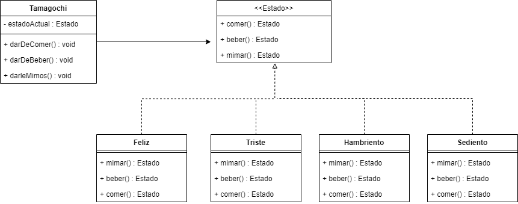

<link rel="stylesheet" type="text/css" media="all" href="../styles.css" />

# C20 - Tamagochi

## UML




En **Interface**  `Estado.java`: Cualquier cosa que sea un estado tiene que implementar comer, beber y mimar.

```java
package com.company;

public interface Estado {

    public Estado comer();
    public Estado beber();
    public Estado mimar();
}
```
 
## Clases

En `Feliz.java`
```java
package com.company;

public class Feliz implements Estado {

    @Override
    public Estado comer() {
        return new Sediento();
    }

    @Override
    public Estado beber() {
        return new Hambriento();
    }

    @Override
    public Estado mimar() {
        return this;
    }
}

```

En `Triste.java`

```java
package com.company;

public class Triste implements Estado {
    @Override
    public Estado comer() {
        return this;
    }

    @Override
    public Estado beber() {
        return this;
    }

    @Override
    public Estado mimar() {
        return new Feliz();
    }
}

```

En `Hambriento.java`

```java
package com.company;

public class Hambriento implements Estado {
    @Override
    public Estado comer() {
        return new Feliz();
    }

    @Override
    public Estado beber() {
        return new Triste();
    }

    @Override
    public Estado mimar() {
        return this;
    }
}

```

En `Sediento.java`

```java
package com.company;

public class Sediento implements Estado {
    @Override
    public Estado comer() {
        return new Triste();
    }

    @Override
    public Estado beber() {
        return new Feliz();
    }

    @Override
    public Estado mimar() {
        return this;
    }
}

```

En `Tamagochi.java`

```java
package com.company;

public class Tamagochi {
    private Estado estadoActual;

    //Constructor Tamagochi arranca feliz
    public Tamagochi() {
        estadoActual = new Feliz();
    }

    //Responsabilidades
    public void darDeComer(){
        estadoActual = estadoActual.comer();
    }
    public void darDeBeber(){
        estadoActual = estadoActual.beber();
    }
    public void darleMimos(){
        estadoActual = estadoActual.mimar();
    }

    public Estado getEstadoActual() {
        return estadoActual;
    }
}
```

En `Main.java`

```java
package com.company;

public class Main {

    public static void main(String[] args) {

        Tamagochi tamagochi = new Tamagochi();

        System.out.println(tamagochi.getEstadoActual());

        tamagochi.darleMimos(); //Esta feliz
        tamagochi.darDeComer(); // Si esta feliz y le di de comer se pone sediento.
        tamagochi.darDeComer(); // Sie sta sediento y le doy de comer se pone triste
        tamagochi.darleMimos();
        tamagochi.darleMimos();
        tamagochi.darleMimos();
        tamagochi.darleMimos();

        System.out.println(tamagochi.getEstadoActual());

    }
}

```

## [⏪ Atrás](../README.md)