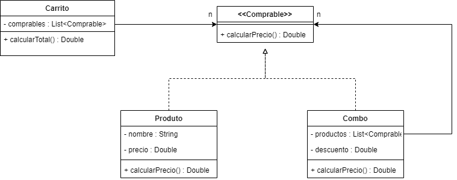

<link rel="stylesheet" type="text/css" media="all" href="../styles.css" />

# C22 - Hamburgueseria

1. Se debe desarrollar el `carrito` de compras de un servicio de e-commerce para una cadena de comida rápida. Deben modelar un carrito capaz de agregar los `productos` que los usuarios desean comprar (diferentes sándwiches y acompañamientos como papas fritas, ensaladas y gaseosas). De ellos se conoce `nombre` y `precio`.
2. Además, se desea poder agregar al carrito menús especiales (`combos`) que ya vienen armados con una selección de `diferentes productos` y el `precio` del combo `es la suma del precio de cada uno de los productos menos un descuento`.

El carrito debe poder informar cuánto es el `total de la compra`.

## UML



## Implementacion

En `interface Comparable.java`

```java
package com.company;

public interface Comprable {
    //contiene el contrato
    public Double calcularPrecio();
}
```

En `Carrito.java`

```java
package com.company;

import java.util.ArrayList;
import java.util.List;

public class Carrito {

    private List<Comprable> comprables;

    public Carrito() {
        this.comprables = new ArrayList<>();
    }

    public void agregarComprable(Comprable comprable){
        comprables.add(comprable);
    }

    public Double calcularPrecioCarrito(){
        Double precioTotal = 0.0;
        for (Comprable comprable : comprables) {
           precioTotal += comprable.calcularPrecio();
        }
        return precioTotal;
    }
}
```

En `Producto.java`

```java
package com.company;

//Producto implementa comprable; tiene que omplementar el metodo calcularPrecio
public class Producto implements Comprable {
    //Atributos del producto
    private String nombre;
    private Double precio;
    //constructor del Producto,
    public Producto(String nombre, Double precio) {
        this.nombre = nombre;
        this.precio = precio;
    }

    //Metodo por contratp, devuelve precio
    @Override
    public Double calcularPrecio() {
        System.out.println(" encontre el producto " + nombre + " cuesta " + precio);
        return precio;
    }
}
```

En `Combo.java`

```java
package com.company;

import java.util.ArrayList;
import java.util.List;

public class Combo implements Comprable {

    private List<Comprable> comprables;
    private Double descuento;

    public Combo(Double descuento) {
        this.descuento = descuento;
        comprables = new ArrayList<>();
    }

    //Elegir ingreso de tipo Comprable ya que puede ponerse producto pero limita agregar un combo
    public void agregarComprable(Comprable comprable){
        comprables.add(comprable);
    }

    //Metodo por contrato tiene que iterar comprable
    @Override
    public Double calcularPrecio() {
        Double precioTotal = 0.0;
        System.out.println("estoy recorriendo un combo");
        for (Comprable comprable : comprables) {
            precioTotal += comprable.calcularPrecio();
        }
        Double precioFinal = precioTotal - (precioTotal * descuento);
        System.out.println("termine de recorrer el combo el precio final es " + precioFinal);
        return precioFinal;
    }
}
```

En `Main.java`

```java
package com.company;

public class Main {

    public static void main(String[] args) {

        Producto hamburgesa = new Producto("bigDH",5.0);
        Producto papaFrita = new Producto("papa frita",2.0);
        Producto gaseosa = new Producto("CocaCola",1.5);
        Producto helado =  new Producto("helado", 1.2);

        Combo combo1 = new Combo(0.1);
        combo1.agregarComprable(hamburgesa);
        combo1.agregarComprable(papaFrita);
        combo1.agregarComprable(gaseosa);

        Combo combo2 = new Combo(0.2);
        combo2.agregarComprable(combo1);
        combo2.agregarComprable(combo1);

        //Combinacion entre productos simples y listas
        Combo combo3 = new Combo(0.3);
        combo3.agregarComprable(combo1);
        combo3.agregarComprable(helado);
        combo3.agregarComprable(helado);
        combo3.agregarComprable(helado);
        combo3.agregarComprable(combo2);

        //Creo carrito
        Carrito carrito = new Carrito();
        //Meto los combos al carrito
        carrito.agregarComprable(combo1);
        carrito.agregarComprable(combo2);
        carrito.agregarComprable(combo3);

        System.out.println(carrito.calcularPrecioCarrito());

    }
}
```

## [⏪ Atrás](../README.md)