<t>Bases de Datos II <t>

**¿Cuál es nuestro objetivo?**
La información que se produce diariamente, necesita ser manipulada y tratada de manera rápida, óptima y segura, por eso utilizando las herramientas y técnicas aprendidas en la materia Base de datos I e incorporando nuevas funcionalidades y tecnologías, lograremos alcanzar esos objetivos al finalizar esta materia.

Las bases de datos relacionales y no relacionales están provistas de funciones y características complejas que, bien utilizadas, brindan excelentes resultados. El conocimiento y manejo de las mismas es indispensable para cualquier aplicación informática hoy en día.


**¿Qué vamos a lograr?**
Afianzar el pensamiento analítico en la gestión de datos y comprender la trayectoria entre el requerimiento y su implementación física.
Configurar una base de datos relacional y no relacional para que obtenga su mayor performance en grandes volúmenes de datos.
Acceder a la información con el lenguaje propio de la herramienta, de manera tal que los resultados obtenidos sean confiables y seguros.
Lograr la optimización del uso de los datos, de forma que el volumen de los mismos no sea un impedimento en los tiempos de proceso. Reconocer la forma correcta del tratamiento de la información, a fin de no entorpecer el acceso de otros usuarios simultáneamente.
Introducirse en el mundo de Big Data, Data Warehouse, sus conceptos y aplicaciones.

[Cronograma](./Cronograma%20de%20cursada.pdf)
[Programa](./Programa%20Base%20de%20Datos%20II.pdf)

**¿Qué herramientas vamos a utilizar?**
Las bases de datos suelen ser un tema super apasionante. Que las emociones no nos hagan perder el camino y veamos si tenemos todo lo necesario para comenzar.

Para poder trabajar en clase vamos a tener que contar con dos elementos importantes:

- Un gestor de base de datos.
- Una herramienta que nos permita manipular la base de datos.

Ambos deben correr en forma local en nuestras computadoras, por lo cual debemos instalarlos. En el siguiente instructivo vamos a ver cómo instalar MySQL Workbench en los diferentes sistemas operativos.


----------------------

## Índice

1. Módulo 1 - Recordando BD 1

- [Repaso](#m1) 
 - [Insert, Update, Delete](c1a)
 - [Select, Where y Order By, Limit y Offset y Alias](c1b)
 - [Group By Y Having](#c1c)
 - [Joins](#c1d)
- mdts

2. Módulo 2 - Programando en base de datos relacionales
- [Bases de datos relacionales](#m2)  
 - [Funciones](#c4)
    - [Estructura de una función](c4-1)
    - [Características de una función](c4-2)
    - [Create y Drop de una función](c4-3)
    - [Variables de un Función](#c4-4)
        - [Asignar valores a variables](#c4-5)
    - [Parámetros de un función](#c4-6)
         - [parámetro IN](#c4-7)
 - [Procedimientos](#c4-8)
    - [Estructura de un procedimiento](c4-9)
    - [Definición de un procedimiento](c4-10)
    - [Variables de un procedimiento](c4-10)
        - [Asignar valores a variables en procedures](#c4-11)
     - [Parámetros de un procedimiento](#c4-12)
        - [parámetro IN](#c4-13)
        - [parámetro OUT](#c4-14)
        - [parámetro INOUT](#c4-15)
    - [Bloque de sentencias](#c4-16)
- [Control de flujo](#c4-17)
- [Cursor](#c4-18)
    - [Manejo de errores](#c4-19)
    - [Ventajas y desventajas](#c4-20)
- [Procedimientos vs Funciones](#c4-21)

- [Funciones MySQL](#c4-22)
    - [Tipos](#c4-23)
        - [Funciones de cadenas o textos](#c4-24)
        - [Funciones numéricas](#c4-25)
        - [Funciones de fecha](#c4-26)
        - [Funciones de ventana](#c4-27)
        - [Funciones de información](#c4-27)
        - Funciones almacenadas

- [Variables](#c7)
- [Condicionales](#c7-1)
- [Estructuras repetitivas](#c7-2)

- [Cursores](#c8)
 - [Ventajas y Desventajas](#c8-1)

- [Tablas Temporales](#c8-2)

- [Subconsultas](#c9-1)
  - [Escalares](#c9-1-1)
  - [Subconsultas con EXISTS o NOT EXISTS](#c9-1-2)
  - [Subconsultas relacionadas](#c9-1-3)

- [Triggers](#c9-2)
  - [Crear un trigger](#c9-2-1)
  - [Eliminar un trigger](#c9-2-2)
  - [¿Cuándo se usan?](#c9-2-3)

- [Manejo de errores](#c10)
  - [Handlers](#c10-1)
    - [Creación](#c10-1-1)
    - [Tipos de condiciones](#c10-1-1)
  - [Conditions](#c10-2)
    - [Creación](#c10-2-1)
    - [Tipos de condiciones](#c10-2-2)
    
- [Transacciones](#c10-3)
  - [Niveles de aislamiento](#c10-4)

- [Optimización](#c11)
 - [Índices](#c11-1)
   - Ventajas y Desventajas
   - [Índices agrupados](#c11-1)
   - [Índices agrupados](#c11-2)
   - [Unique](#c11-3)
   - [FullText](#c11-3)
 - [Estructuras de almacenamiento](#c11-5)
   - [B-Tree](#c11-5-1)
   - [Hash](#c11-5-2)
 - [Informes de optimización](#c12)
   - [Schema Inspector](#c12-1)
      - [Cardinalidad](#c12-1-2)
   - [Table Inspector](#c12-2)

- [Herramientas](#c14)

3. Módulo 3 -  Bases de datos no relacionales
- [Bases de datos no relacionales](#m3)  
 - [NOSQL](#c16) 
  - [tipode de datos NOSQL](#c16-1) 
 - [SQL VS NOSQL](#c16-2)  

  - [MongoDB](#c17)  

4. Módulo 4 -  Data never sleeps 
- [Data](#m4)


------- 
<!--###############################################--  MÓDULO 1--#####################################################################-->
##  Recordando BD 1 <a id='m1'></a>
¿Dónde estamos?

[presentación genialy](https://view.genial.ly/62167d51b8bc1d00122e61b3)

Repaso de conceptos básicos en SQL
### Insert, Update, Delete <a id='c1a'></a>
[apuntes](./apuntes/2.%20PPT%20Insert%2C%20Update%2C%20Delete%20-%20new.pdf)

### Select, Where y Order By, Limit y Offset y Alias <a id='c1b'></a>
[Select](./apuntes/2.%20PPT%20Select.pptx.pdf)
[Where y order by](./apuntes/4.%20PPT%20Where%20y%20Order%20By%20.pdf)
[Limit y Offset](./apuntes/6.%20PPT%20Limit%20y%20Offset.pdf)
[Alias](./apuntes/8.%20PPT%20Alias.pdf)
### Group By Y Having <a id='c1c'></a>
[Group by](./apuntes/2.%20PPT%20Group%20By.pdf)
[Having](./apuntes/4.%20PPT%20Having.pdf)
### Joins <a id='c1d'></a>
[Joins](./apuntes/2.%20PPT%20Join.pdf)


### Sintaxis 
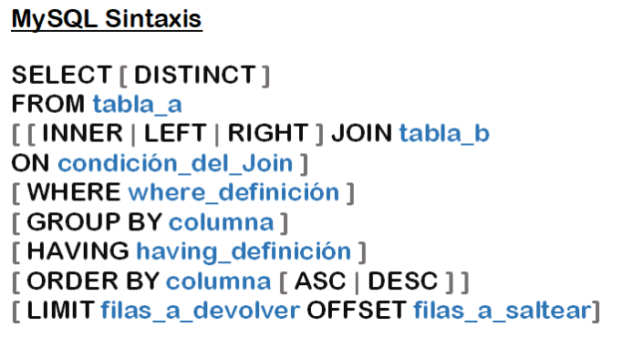


## clase 1 - mdt 

Consigna: generen cinco enunciados de querys a resolver.
## clase 2 y 3 - mdt
Ejercicios varios de queries para repaso (detalles en carpeta clases)

-------
<!--###############################################--  MÓDULO 2 --#####################################################################-->
## Programando en base de datos relacionales <a id='m2'></a>
En Base de datos I vimos que podíamos crear objetos, manipular datos, hacer operaciones con variables, utilizar funciones y crear procedimientos almacenados básicos.

Durante las siguientes semanas aprenderemos sobre objetos que podemos crear para auditoría, a optimizar nuestras consultas para que funcionen en tiempo razonable y más sentencias para tener la habilidad de realizar operaciones más complejas dentro de una base de datos.

A continuación, profundizaremos en procedimientos almacenados y funciones.

### Funciones <a id='c4'></a>
Una función almacenada en MySQL es una rutina
creada para tomar uno o más parámetros, realizarles algún procedimiento y retornar los resultados en una salida.

■ Pueden incluir parámetros solamente de entrada.
■ Deben retornar un valor con algún tipo de dato
definido.
■ Solo retornan un valor individual, no un conjunto de
registros. A esto se le llaman resultados escalares.

Por lo general, se los utiliza para realizar cálculos sobre los datos, obteniendo así lo que llamamos **datos derivados**. De esta forma, se reduce la necesidad de codificar dicha lógica en programas clientes.

#### Estrutura de una función <a id='c4-1'></a>
● CREATE FUNCTION: se escribe este comando
seguido del nombre que identificará a la función.
● RETURNS: se utiliza para indicar qué tipo de dato se retornará. La característica es para definir el tipo de función.
● BEGIN: esta cláusula se utiliza para indicar el inicio del código SQL.
● RETURN: utilizamos este comando para retornar el Bloque de instrucciones SQL.
● END: se utiliza para indicar el final del código SQL.


#### Características de una función <a id='c4-2'></a>

1. DETERMINISTIC: indica que la función siempre devuelve el mismo resultado cuando se utilizan los mismos parámetros de entrada.
2. NOT DETERMINISTIC: indica que la función no siempre devuelve el mismo resultado, aunque se utilicen los mismos parámetros de entrada.
3. CONTAINS SQL: indica que la función contiene sentencias SQL, pero no contiene sentencias de manipulación de datos.
4. NO SQL: indica que la función no contiene
sentencias SQL.
5. READS SQL DATA: indica que contiene sentencias de lectura de datos, como la sentencia SELECT.
6. MODIFIES SQL DATA: indica que la función modifica los datos de la base y que contiene sentencias como INSERT, UPDATE o DELETE.


**Aclaraciones:**
Si no queremos especificar una característica a la función, debemos ejecutar el siguiente comando para que no nos muestre mensaje de error a la hora de crearla:

SET GLOBAL log_bin_trust_function_creators = 1;

No confundir RETURNS con RETURN. La primera es para indicar el tipo de dato de retorno de la función y la segunda es para retornar el valor en el cuerpo de la función.

Si estamos trabajando sobre una query de trabajo, no olvidarse de usar el DELIMITER como se utilizan en los stored procedures.

#### Create y Drop de un Función <a id='c4-3'></a>


### Variables <a id='c4-4'></a>
● Dentro de una función se permite declarar variables, es decir, elementos que almacenan datos que pueden ir cambiando a lo largo de la ejecución.
● La declaración de variables se coloca después de la cláusula BEGIN y antes del bloque de instrucciones SQL.
● Opcionalmente, se puede definir un valor inicial mediante la cláusula DEFAULT.


#### Asignación de valores a variables <a id='c4-5'></a>
● Para asignar un valor a una variable se utiliza la cláusula SET.
● Las variables solo pueden contener valores escalares. Es decir, un solo valor


### Parámetros <a id='c4-6'></a>
■ Los parámetros son variables por donde se envían y
reciben datos de programas clientes.
■ Se definen dentro de la cláusula CREATE.
■ Las funciones pueden tener uno, varios o ningún
parámetro de entrada.
■ No pueden ingresarse parámetros del tipo OUT o
INOUT.

#### Declaración del parámetro IN <a id='c4-7'></a>
Es un parámetro de entrada de datos y se utiliza para recibir valores. Este parámetro viene definido por defecto cuando no se especifica su tipo.


----

Podemos decir que las funciones son nuestras
funciones de alteración personalizadas. Mayormente son utilizadas para cuando se necesitan atributos derivados de los datos de nuestras tablas y que se utilicen en varias consultas de nuestro negocio.

Otra ventaja es que el uso de funciones puede ayudar a mejorar en gran medida el rendimiento y la performance general del sistema.

----

### Procedimientos <a id='c4-8'></a>
Los SP (stored procedure) son un conjunto de
instrucciones en formato SQL que se almacenan, compilan y ejecutan dentro del servidor de bases de datos.

Pueden incluir parámetros de entrada y salida, devolver resultados tabulares o escalares, mensajes para el cliente e invocar instrucciones DDL y DML.

Por lo general, se los utiliza para definir la lógica del negocio dentro de la base de datos y reducir la necesidad de codificar dicha lógica en programas clientes.

#### Estrutura de un procedimiento <a id='c4-9'></a>

● DELIMITER: se escribe esta cláusula seguida de una combinación de símbolos que no serán utilizados en el interior del SP.
● CREATE PROCEDURE: se escribe este comando
seguido del nombre que identificará al SP.
● BEGIN: Esta cláusula se utiliza para indicar el inicio del código SQL.
● Bloque de instrucciones SQL.
● END: se escribe esta cláusula seguida de la
combinación de símbolos definidos en DELIMITER y se utiliza para indicar el final del código SQL.

Ejemplo:


#### Definición de un procedimiento <a id='c4-10'></a>


#### Variables de un procedimiento <a id='c4-10'></a>
Declaración: 
● Dentro de un SP se permite declarar variables que son elementos que almacenan datos que pueden ir cambiando a lo largo de la ejecución.
● La declaración de variables se coloca después de la cláusula BEGIN y antes del bloque de instrucciones SQL.
● Opcionalmente, se puede definir un valor inicial mediante la cláusula DEFAULT.


#### Asignación de valores a variables <a id='c4-11'></a>
● Para asignar un valor a una variable se utiliza la cláusula SET.
● Las variables solo pueden contener valores escalares. Es decir, un solo valor.


#### Parámetros de un Procedure <a id='c4-12'></a>
■ Los parámetros son variables por donde se envían y reciben datos de programas clientes.
■ Se definen dentro de la cláusula CREATE.
■ Los SP pueden tener uno, varios o ningún parámetro de entrada y asimismo, pueden tener uno, varios o ningún parámetro de salida.
■ Existen tres tipos de parámetros:


#### Declaración del parámetro IN <a id='c4-13'></a>
Es un parámetro de entrada de datos y se utiliza para recibir valores. Este parámetro viene definido por defecto cuando no se especifica su tipo.


#### Declaración del parámetro OUT <a id='c4-14'></a>
Es un parámetro de salida de datos y se utiliza para devolver valores.


#### Declaración del parámetro INOUT <a id='c4-15'></a>
Es un mismo parámetro que se utiliza para la entrada y salida de datos. Puede recibir valores y devolver los resultados en la misma variable.


#### Bloque de sentencias <a id='c4-16'></a>
Dentro del bloque BEGIN...END, además de la definición de variables se pueden escribir distintas sentencias para nuestros procedimientos:

■ Sentencias de control de flujo
■ Cursores
■ Manejo de errores


#### Control de flujo <a id='c4-17'></a>
Cuando necesitamos aplicar condiciones y/o bucles en nuestro programa, MySQL nos brinda las siguientes sentencias:

1. CASE: se utiliza para condicionales complejas.
2. IF: se utiliza para condicionales simples.
3. ITERATE: vuelve a empezar una iteración. Solo se utiliza en Loop, Repeat y While.
4. LEAVE: se utiliza para salir de iteraciones.
5. LOOP: bucle que se ejecuta x cantidad de veces.
6. REPEAT: bucle que se ejecuta hasta que se cumple una condición.
7. RETURN: se utiliza para retornar un valor en una función o procedimiento.
8. WHILE: bucle que se ejecuta mientras se cumpla una condición.

Ejemplos:


### Cursor <a id='c4-18'></a>
En el resultado de una consulta, ¿cómo podríamos realizar operaciones por cada uno de los registros del resultado?
Para ello existen los cursores, en MySQL tenemos las siguientes sentencias para su definición y uso.

DECLARE: se utiliza para definir el cursor
OPEN: se utiliza para abrir el cursor.
FETCH: se utiliza para asignar el próximo valor del cursor a una variable.
CLOSE: se utiliza para cerrar un cursor.


### Manejo de errores <a id='c4-19'></a>
Imaginemos que tenemos un error en uno de nuestro procedimiento. ¿Qué realizamos con este error?¿Cómo lo vamos a tratar?
Para esto, MySQL nos permite crear Handlers y
Conditions así podemos aplicar en nuestros programas un correcto manejo de errores.

■ Conditions: son nombres que podemos agregar a los errores para dejar más legible nuestro código.
■ Handlers: Es el manejador de errores. Por cada error que se ejecute, y si esa condición está definida en un handler, el código que definimos será ejecutado.

#### Ventajas y desventajas <a id='c4-20'></a>


### Procedimientos vs Funciones <a id='c4-21'></a>
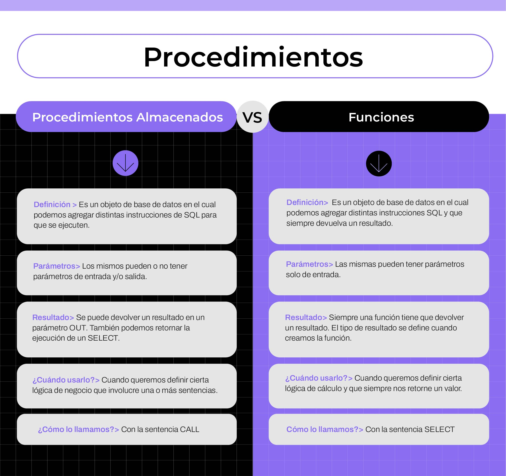

### Funciones de MySQL <a id='c4-22'></a>
MySQL puede hacer mucho más que simplemente
almacenar y recuperar datos. También podemos realizar manipulaciones en los datos antes de recuperarlos o guardarlos. Ahí es donde entran las Funciones de MySQL.
Las funciones son simplemente piezas de código que realizan algunas operaciones y luego devuelven un resultado. Algunas funciones aceptan parámetros mientras que otras funciones no.

#### Tipos <a id='c4-23'></a>
■ Funciones de cadenas o textos
■ Funciones numéricas
■ Funciones de fecha
■ Funciones de ventana
■ Funciones de información
■ Funciones almacenadas(*)

(*) Las funciones almacenadas son las que vimos en la clase anterior. Son las que creamos nosotros mismos.


#### Funciones de cadenas o textos <a id='c4-24'></a>

■ CHARACTER_LENGTH: devuelve la longitud de la cadena —en caracteres—.
■ CONCAT: junta 2 o más cadenas de texto.
■ FORMAT: formatea un número a un formato como "#, ###, ###. ##", redondeado a un número específico de posiciones decimales.
■ INSERT: inserta una cadena dentro de una cadena en la posición especificada y para un cierto número de caracteres.
■ LEFT: extrae varios caracteres de una cadena comenzando desde la izquierda.
■ LOCATE: devuelve la posición de la primera aparición de una subcadena en una cadena.
■ LOWER: convierte una cadena en minúsculas.
■ REPLACE: reemplaza todas las apariciones de una subcadena dentro de una cadena, con una nueva subcadena.
■ UPPER: convierte una cadena en mayúsculas.
■ RIGHT: extrae varios caracteres de una cadena comenzando desde la derecha.
■ SUBSTR: extrae una subcadena de una cadena —comenzando en cualquier posición—.

#### Funciones númericas <a id='c4-25'></a>
Funciones más utilizadas —quitando las ya conocidas AVG, SUM, MAX, MIN, COUNT—:
■ GREATEST: devuelve el mayor valor de la lista de argumentos.
■ LEAST: devuelve el valor más pequeño de la lista de argumentos.
■ MOD: devuelve el resto de un número dividido por otro número.
■ POW: devuelve el valor de un número elevado a la potencia de otro número.
■ ROUND: redondea un número a un número
específico de decimales.
■ SQRT: devuelve la raíz cuadrada de un número.
■ TRUNCATE: trunca un número al número
especificado de posiciones decimales.

#### Funciones fecha <a id='c4-26'></a>
■ ADDDATE: agrega un intervalo de hora / fecha a una fecha y luego devuelve la fecha.
■ CURDATE: devuelve la fecha actual.
■ DATEDIFF: devuelve el número de días entre dos valores de fecha.
■ DATE_FORMAT: formatea una fecha.
■ EXTRACT: extrae una parte de una fecha
determinada.
■ LAST_DAY: extrae el último día del mes para una fecha determinada.
■ SEC_TO_TIME: devuelve un valor de tiempo basado en los segundos especificados.

#### Funciones ventana <a id='c4-27'></a>
Una función de ventana realiza un cálculo en un conjunto de filas de la tabla que de alguna manera están relacionadas con la fila actual. Esto es comparable al tipo de cálculo que se puede hacer con una función de agregación —AVG, COUNT, SUM, etc.—.

Pero, a diferencia de las funciones agregadas normales, el uso de una función de ventana no hace que las filas se agrupen en una sola fila de salida; las filas conservan sus identidades separadas. Detrás de escena, la función de ventana puede acceder a más que solo la fila actual del resultado de la consulta.

Las más utilizadas:
■ FIRST_VALUE: Devuelve el primer valor del primer registro de nuestra consulta.
■ LAG: Devuelve el valor anterior del registro actual que estamos mostrando.
■ LAST_VALUE: Devuelve el valor del último registro de nuestra consulta.
■ LEAD: Devuelve el valor siguiente del registro actual que estamos mostrando.
■ NTILE: Divide la cantidad de resultados por el parámetro que recibe y asigna un grupo a cada uno de los registros.
■ ROW_NUMBER: Devuelve el número de la fila actual dentro de la cantidad de resultados. Los números de filas van desde 1 hasta el número de filas de resultados.


[consulta la documentación aquí](https://dev.mysql.com/doc/refman/8.0/en/window-function-descriptions.html)

#### Funciones información <a id='c4-28'></a>
Las funciones de información del sistema se utilizan para consultar la información del sistema de la base de datos MySQL.

Se utilizan también para obtener información sobre las conexiones a nuestra base.


[consulta la documentación aquí](https://dev.mysql.com/doc/refman/8.0/en/information-functions.html)

Funciones más utilizadas:

■ CURRENT_ROLE: Devuelve los roles activos actuales del usuario conectado.
■ CURRENT_USER: Devuelve el nombre de usuario y el nombre de host autenticados.
■ DATABASE: Devuelve el nombre de la base de datos actual.
■ LAST_INSERT_ID: Devuelve el valor de la columna AUTOINCREMENT para el último INSERT.
■ ROW_COUNT: Devuelve el número de filas actualizadas.
■ VERSION: Devuelve una cadena que indica la versión del servidor MySQL.

#### Variables <a id='c7'></a>
Las variables  son elementos que almacenan datos que pueden ir cambiando a lo largo de la ejecución.
Para hacer esto, almacena el valor de la misma en su  primera declaración y se refiere a ella en las siguientes declaraciones.

Hay varios tipos: De Usuario, locales y de sistema.

La vida útil de una variable definida por el usuario dura mientras la sesión esté activa, y es invisible para otras sesiones. Una vez que la 
sesión se cierra, la variable desaparece.


Las variables locales no necesitan el prefijo @ en sus 
nombres, pero deben ser declaradas antes de que puedan ser usadas. Para declarar una variable local, se puede usar la declaración DECLARE o usarla como un parámetro dentro de una declaración STORED PROCEDURE o FUNCTION.


Hay un tercer tipo de variables llamadas variables del sistema que se usan para almacenar valores que afectan a las conexiones individuales de los clientes —variables de SESSION— o que afectan a toda la operación del servidor —variables GLOBAL—.
Las variables del sistema pueden ser identificadas usando un doble signo @ como prefijo o usando las palabras GLOBAL o SESSION en la sentencia SET.


#### Condicionales <a id='c7-1'></a>
Estas son IF, CASE e IF anidados.


[genially](https://view.genial.ly/620ba24a07820e00123a1db3)

#### Estructuras repetitivas <a id='c7-2'></a>
Las estructuras repetitivas son While, Repeat, y Loop.


[genially](https://view.genial.ly/620e9e0309558700184a1b7a)

#### Revisar lo aprendido 

Variables #1 - Declaración:
¿Cuál es la sintaxis correcta para crear una variable llamada “pepe” dentro de un SP, y asignarle el valor 10 en la misma línea?

Pista: En este ejercicio tienes que declarar una variable local para el SP. Agregar siempre el ; al final del código. Recordá asignar el tipo de dato.
```
DECLARE pepe INT DEFAULT 10;
```

Variables #2 - Declaración 2

¿Cuál es la sintaxis correcta para crear una variable llamada “pepe” dentro de una query, y asignarle el valor “hola” en la misma línea?

 

Pista: En este ejercicio tienen que declarar una variable local para una query. Agregar siempre el ; al final del código. Recordemos usar comillas simples para los textos.
```
DECLARE pepe STRING DEFAULT 'hola';

```

Variables #3 - Variables del sistema

Si queremos ver todas las variables del sistema que contienen la palabra port, ¿qué código deberíamos ejecutar?
Ingresar debajo del código, la posición en la que encontramos el registro “port” para la columna Variable_name.

 

Pista: En este ejercicio tienes que ver todas las variables del sistema. Agregar siempre el ; al final del código. La posición debe ser ingresada en número y sin ; al final debajo del código pedido. 
```
SHOW VARIABLES LIKE 'port';
```

#### Cursores <a id='c8'></a>
Un cursor nos permite realizar una o más operaciones por cada uno de los registros de nuestra consulta.

En MySQL podemos definir el cursor con las siguientes sentencias.
1. DECLARE: se utiliza para definir el cursor
2. OPEN: se utiliza para abrir el cursor.
3. FETCH: se utiliza para asignar el próximo valor del cursor a un variable.
4. CLOSE: se utiliza para cerrar un cursor.

Aclaración, hay 2 sentencias que agregar a los cursores: un LOOP para recorrer los registros del SELECT, y un HANDLER
para cuando nos quedemos sin registros por recorrer en el SELECT.
1. DECLARE CONTINUE HANDLER FOR NOT FOUND SET finished = 1;
2. ABRIR EL LOOP.
3. IF finished = 1 THEN LEAVE recorre; END IF;
4. CERRAR EL LOOP

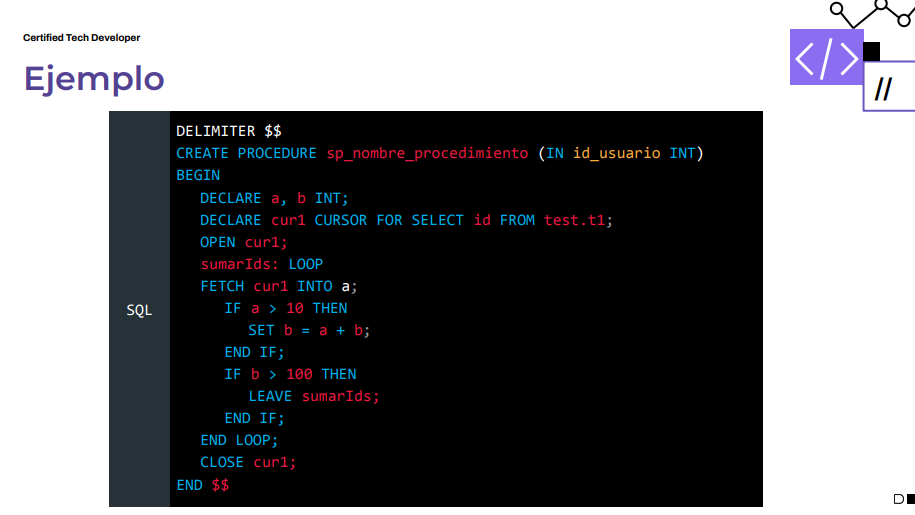

#### ¿Cuándo usarlos? 
Siempre utilizaremos un cursor cuando queramos procesar individualmente cada fila de una consulta.

#### Ventajas y Desventajas<a id='c8-1'></a>


#### Tablas temporales <a id='c8-2'></a>
Cuando necesitemos mejorar el rendimiento de nuestras consultas y procedimientos, una de las alternativas que tenemos es amigarnos con un nuevo objeto de nuestra base de datos: Tablas Temporales.

Una tabla temporal es un tipo de tabla que nos permite guardar resultados de forma temporal. Podemos acceder a esos datos cuantas veces queramos y siempre que estemos en una misma sesión.
Son muy útiles para evitar ejecutar varias veces la misma consulta, ya que podemos ejecutar una sola vez la consulta, guardar los resultados temporalmente y luego accedemos directamente a la tabla temporal.

La podemos crear de la siguiente manera:


Las operaciones que podemos realizar a la tabla temporal dentro de una sesión son: DROP, SELECT, INSERT y UPDATE.

Un ejemplo de TT:


#### Practica
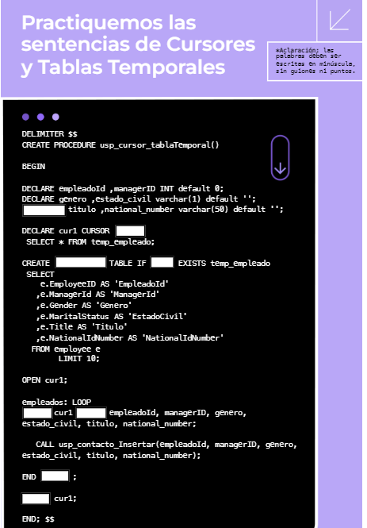

### Subconsultas <a id='c9-1'></a>
Una subconsulta es una consulta escrita dentro de otra consulta. Tenemos la opción de anidar consultas para agregar más lógica y así filtrar y/o agregar más información a nuestros resultados. Las mismas pueden retornar un único valor, una columna con varios registros y/o también varias columnas con varios valores.

#### Tipos de subconsultas
#### Escalares <a id='c9-1-1'></a>
Estas subconsultas devuelven un único valor escalar. Por ejemplo, si queremos ver el o los clientes  que tienen la última factura, podemos crear la siguiente consulta:

```sql
SELECT c.* 
FROM factura f 
INNER JOIN cliente c 
ON f.id_cliente = c.id_cliente
WHERE fecha_factura = (SELECT MAX(fecha_factura) FROM factura )
```
#### Subconsultas con EXISTS o NOT EXISTS <a id='c9-1-2'></a>
¿Recuerdan que en BDI que vimos EXISTS y NOT EXISTS ? ¡Es porque los usamos para subconsultas! Si la subconsulta retorna valores, entonces Exist subconsulta es verdadero, si la consulta no retorna valores, Exists subconsulta es falso.

```sql
SELECT c.* 
FROM factura f 
INNER JOIN cliente c 
ON f.id_cliente = c.id_cliente
WHERE EXISTS (SELECT * FROM cliente  )
```

#### Subconsultas relacionadas <a id='c9-1-3'></a>
La subconsulta que se hace tiene relación y campos correlacionados con la consulta padre. 

```sql
SELECT f.* 
FROM factura f 
INNER JOIN cliente c 
ON f.id_cliente = c.id_cliente
WHERE EXISTS (SELECT * FROM cliente c2 where c2.nombre like ‘%Juan%’ and c.id_cliente = c2.id_cliente  )
```

Además tenemos subconsultas de filas y correlacionadas, pero no las veremos en este curso.

#### Triggers <a id='c9-2'></a>
Los triggers son objetos de base de datos que nos
sirven para ejecutar código SQL luego de que
se haya ejecutado una sentencia de Insert,
Update o Delete sobre una tabla específica.

● Un trigger siempre está asociado a una tabla.
● Los triggers no se pueden definir para tablas temporales como tampoco para vistas.

#### Crear un trigger: <a id='c9-2-1'></a>


➔ tiempoTrigger: pueden ser los valores BEFORE o AFTER. Esto es para definir cuándo se ejecuta el trigger. MySQL permite ejecutar el código ANTES de una operación sobre la tabla o DESPUÉS de la operación sobre la tabla.
➔ eventoTrigger: pueden ser los valores INSERT, UPDATE o DELETE . Este es el evento que se ejecuta sobre nuestra tabla que va a disparar el trigger.
➔ ordenTrigger: pueden ser los valores FOLLOWS o PRECEDES nombreTrigger. En caso de que tengamos varios triggers en nuestra tabla, tenemos la opción de agregar el orden de ejecución de los mismos.
➔ cuerpoTrigger: cuerpo del trigger. Si queremos ejecutar varias sentencias, podemos agregar el bloque BEGIN…END

#### Eliminar un trigger: <a id='c9-2-2'></a>


#### ¿Cuándo se usan? <a id='c9-2-3'></a>
Se usan en los siguientes casos:
■ Modificar datos
■ Reglas complejas
■ Auditoría

#### Manejo de errores <a id='c10'></a>
Podemos encontrarnos con muchos errores de SQL en nuestros programas de base de datos pero no desesperen: los handlers y conditions vienen a nuestro rescate


#### Handlers <a id='c10-1'></a>
■ Es el manejador de errores. Por cada error que se ejecute, y si esa condición está definida en un handler, el código que definimos será ejecutado.

#### Creación <a id='c10-1-1'></a>
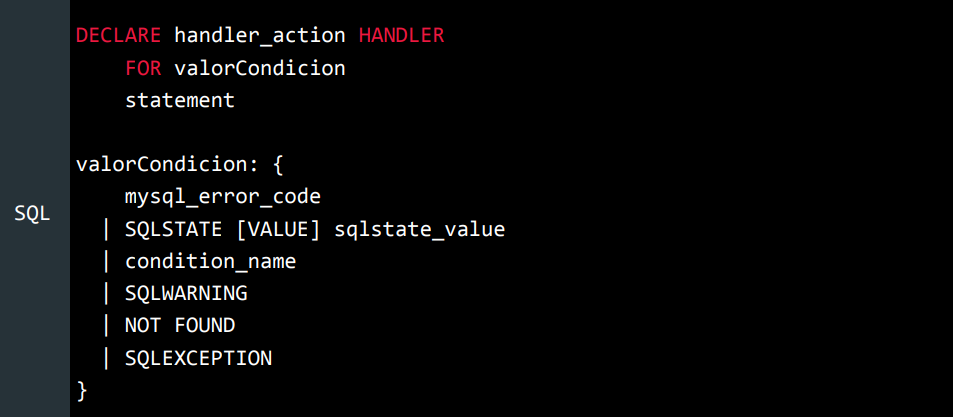

➔ handler_action: puede ser los siguientes valores: continue, exit y undo.
➔ Continue: Ante la ejecución del handler, este continúa con la ejecución
del bloque BEGin..End.
➔ Exit: termina la ejecución del bloque begin..End que disparó el handler.
➔ valorCondicion: Son los errores que vamos a capturar con nuestro
handler. Ante alguno de estos errores, se ejecutará el código que
definamos. Para ello, tenemos varios tipos de condiciones.
#### Tipos de condiciones <a id='c10-1-1'></a>
1- Mysql_error_code: es un valor numérico que indica un error de sql. podemos definir por ejemplo el valor 1051. Son los que están en la siguiente documentación: clic aquí.
2- SQLState: es un string que indica un error. por ejemplo el valor 42S02. Los valores posibles son los que están en la siguiente documentación: clic aquí.
3- Condition_name: Si definimos una condition, podemos agregar el nombre de la misma.
4- SQLWarning: es un abreviado para incluir a todos los códigos de SQLSTATE que empiezan con ‘01’
5- Not Found: es un abreviado para incluir a todos los códigos de SQLSTATE que empiezan con ’02’
6- SQLEXCEPTION: es un abreviado que excluye a todos los códigos de SQLSTATE que empiezan con ‘00’, ‘01’, ‘02’
#### Conditions <a id='c10-2'></a>
■ Son nombres que podemos agregar a los errores para dejar más legible nuestro código.

#### Creación <a id='c10-2-1'></a>


#### Tipos de condiciones <a id='c10-2-2'></a>
➔ valorCondicion: Son los errores que vamos a capturar con nuestro handler. Ante alguno de estos errores, se ejecutará el código que definamos. Para ello, tenemos varios tipos de condiciones:
1- mysql_error_code: es un valor numérico que indica un error de sql.
Podemos definir, por ejemplo, el valor 1051. Son los que están en esta documentación.
2- SQLState: es un string que indica un error. Por ejemplo, el valor 42S02. Los valores posibles son los que están en la documentación 

#### Uso:
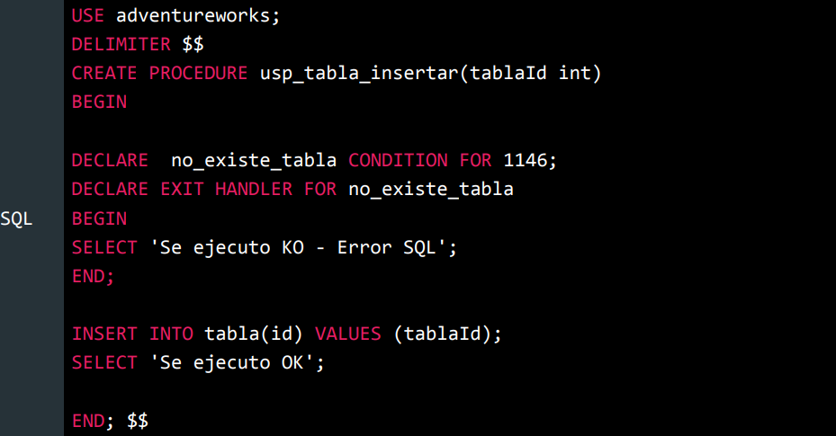

#### Transacciones <a id='c10-3'></a>
Esta nueva estructura es muy utilizada para mantener la integridad de los datos dentro de una base de datos.
#### Sintaxis:
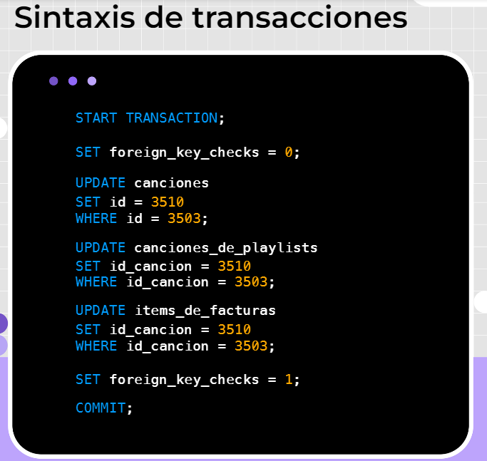


####  Niveles de aislamiento <a id='c10-4'></a>
Las transacciones definen un nivel de aislamiento que determina la forma en que una transacción se aísla de las demás transacciones. El aislamiento es la separación de las modificaciones de estructura o datos realizadas por diferentes transacciones. Los niveles de aislamiento se definen para los efectos secundarios de la simultaneidad que existen, como las lecturas de datos sucios o las lecturas fantasma.

Primero, definamos las propiedades ACID (Atomicity, Consistency, Isolation y Durability) que garantizan que las transacciones se puedan realizar en una base de datos de forma segura.

■ Atomicidad después de que comienza la transacción, todas las operaciones se completan o no se realizan. Es imposible estancarse en el medio. Si se produce un error durante la ejecución de la transacción, se revertirá al estado anterior al inicio de la transacción. En otras palabras, el bloque de código es un todo indivisible, al igual que un átomo.

■ Consistencia antes de que la transacción comience y termine, las restricciones de integridad de la base de datos siguen existiendo. Los datos luego de la transacción deben seguir siendo consistentes.

■ Aislamiento al mismo tiempo, solo una transacción puede solicitar los mismos datos, y las diferentes transacciones no interfieren entre sí. Por ejemplo, si una transacción quiere acceder de forma concurrente a los datos que están siendo utilizados por otra transacción, no podrá hacerlo hasta que la primera haya terminado.

■ Durabilidad una vez completada la transacción, todas las actualizaciones de la base de datos por la transacción se guardarán en la base de datos y no se pueden revertir, es decir, son permanentes.
Ahora definamos los problemas de concurrencia que pueden surgir en una base de datos:

■ Lectura sucia supongamos que tenemos 2 transacciones: A y B. La transacción A lee los datos actualizados por la transacción B, y luego B revierte la operación, luego los datos leídos por A son datos sucios.


■ Lectura no repetible se produce cuando una transacción consulta el mismo dato dos veces durante la ejecución de la transacción y, la segunda vez, encuentra que el valor del dato ha sido modificado por otra transacción.


■ Lectura fantasma: este error ocurre cuando una transacción ejecuta dos veces una consulta que devuelve un conjunto de filas y en la segunda ejecución de la consulta aparecen nuevas filas en el conjunto que no existían cuando se inició la transacción.


Para evitar que sucedan los problemas de acceso concurrente que hemos comentado anteriormente podemos establecer diferentes niveles de aislamiento que controlan el nivel de bloqueo durante el acceso a los datos. Existen cuatro niveles de aislamiento para MySQL:

■ Read Uncommitted: en este nivel no se realiza ningún bloqueo, por lo tanto, permite que sucedan los tres problemas.
Read Committed: en este caso los datos leídos por una transacción pueden ser modificados por otras transacciones, por lo tanto, se pueden dar los problemas lectura no repetible y lectura fantasma.
Repeatable Read: en este nivel ningún registro leído con un SELECT puede ser modificado en otra transacción, por lo tanto, sólo puede suceder el problema de lectura fantasma.

■ Serializable: en este caso las transacciones se ejecutan unas detrás de otras, sin que exista la posibilidad de concurrencia.
Dejamos una tabla con esta información.


Podemos consultar el nivel de aislamiento que estamos utilizando, consultando el contenido de la variable global y de sesión @@transaction_isolation.
SELECT @@GLOBAL.transaction_isolation;
SELECT @@SESSION.transaction_isolation;

#### Optimización <a id='c11'></a>
### Índice <a id='c11-1'></a>
Un índice es una estructura de datos.
Su función es aumentar la velocidad de las consultas en una tabla.
■ Las instrucciones INSERT y UPDATE llevan más
tiempo en tablas con índices.
■ Las instrucciones SELECT son más rápidas en tablas
con índices.
Esto se debe a que, para realizar una inserción o actualización, una base de datos también necesita agregar o actualizar los valores en el índice.

#### Ventajas y Desventajas 
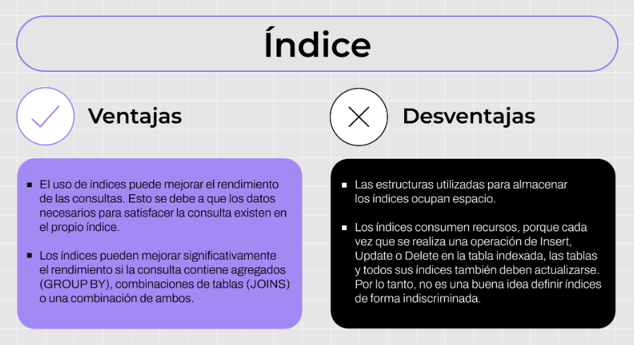

#### Índice agrupado<a id='c11-1'></a>
El índice agrupado (CLUSTERED) se identifica como
primario (PRIMARY), se almacena junto con los datos en
la propia tabla y ordena físicamente los registros
Cada vez que se insertan o actualizan nuevos datos, los datos se reescriben en el índice para mantenerlos ordenados.
Solo puede haber un índice principal por tabla.

####  Índices no-agrupados <a id='c11-2'></a>
Se pueden crear otros índices en campos diferentes y de uso más frecuente. Estos son índices secundarios, no agrupados(NON-CLUSTERED).
El índice no agrupado almacena la columna de clave principal en su estructura, así como las columnas especificadas para crear el índice. Esto crea un puntero, que apunta a la posición real de los datos.
Se pueden crear múltiples índices no agrupados en una tabla. El tamaño de cada índice se suma al tamaño de la tabla. Tengamos en cuenta que hay que evaluar la cantidad de índices que se crean para que no afecte el rendimiento.

En general, MySQL usa índices para realizar las siguientes acciones:
❏ Encontrar rápidamente registros que coincidan con
una cláusula WHERE.
❏ Recuperar registros de otras tablas al usar
operaciones JOIN.
❏ Disminuir el tiempo de ejecución de las consultas con
ordenación (ORDER BY) o agrupamiento (GROUP BY), en el caso que todas las columnas utilizadas en los criterios hagan parte de un índice.

#### Creación 


#### Visualización
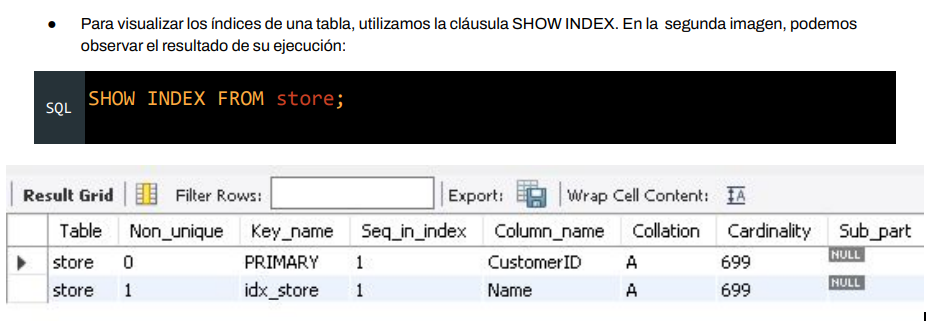

#### Eliminación


#### Confirmación
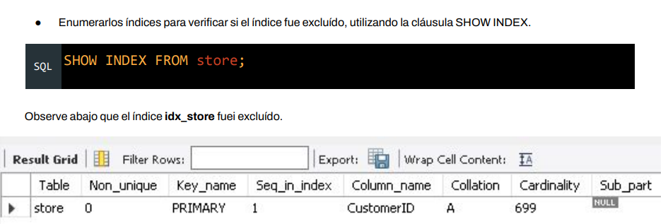

#### Índice no exclusivo


#### Unique <a id='c11-3'></a>
El tipo de índice unique indica que todas las columnas utilizadas en la creación del índice deben tener un valor único.
Es decir, la columna —o columnas— que componen el índice no puede tener valores repetidos.

#### Creación 
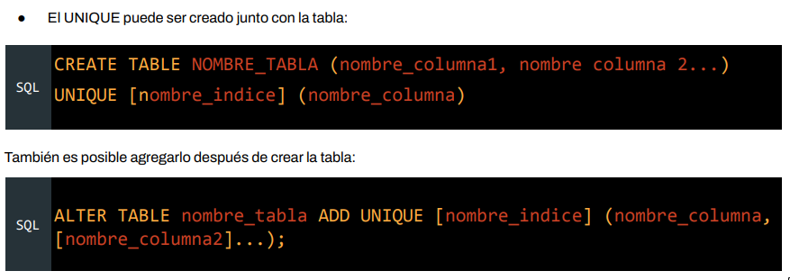

#### FullText <a id='c11-4'></a>
Este índice se utiliza para realizar búsquedas en cadenas
de texto con mayor precisión.
FullText es más potente que usar like porque, además de
ordenar el resultado por similitud semántica, ofrece más
opciones para filtrar la consulta.
Es adecuado para aplicaciones con una gran cantidad de
texto y que necesitan realizar búsquedas basadas en la
relevancia.

#### Creación 


#### Eliminación 
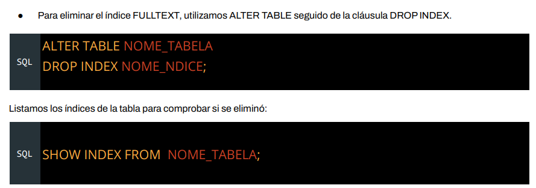

#### Consideraciones
■ En consultas con índice FullText, MySQL descarta
palabras con menos de 4 caracteres.
■ Expresiones como "de", "que" y "o" se excluyen
automáticamente de la búsqueda.
■ Una palabra presente en más del 50% de los registros
será excluida de la búsqueda.

#### Tipos de búsqueda
■ IN NATURAL LANGUAGE MODE - Es el tipo de búsqueda de
Fulltext predeterminado. No hay operadores especiales y lasbúsquedas consisten en una o más palabras clave separadas por una coma. Las búsquedas se devuelven en orden descendente de relevancia.
■ IN BOOLEAN MODE - Permite el uso de varios operadores
especiales. Las búsquedas no se devuelven en orden de
relevancia, ni se aplica el límite del 50% y puede buscar palabras con 4 caracteres o menos.

#### Estructuras de almacenamiento <a id='c11-5'></a>

■ B-TREE <a id='c11-5-1'></a>
Se usa un índice de árbol B para comparaciones del tipo =, >,<, >=, <=, BETWEEN y LIKE —siempre que se use en
constantes que no comiencen con %—.
Para realizar búsquedas utilizando este tipo de índice, se utilizará cualquier columna —o conjunto de columnas que forme el prefijo del índice.
Ejemplo: si un índice está compuesto por columnas [A, B, C], las búsquedas se pueden realizar en: [A], [A, B] o [A, B, C]

■ Hash <a id='c11-5-2'></a>
El tipo de estructura Hash solo se usa para comparaciones de tipo = o <=>. No se utilizan para operadores de comparación, como encontrar un rango de valores.

El optimizador no puede usar un índice hash para acelerar las operaciones ORDER BY —el Hash no se puede usar para buscar la siguiente entrada en orden—.
Para realizar búsquedas utilizando este tipo de índice, se utilizarán todas las columnas que componen el índice.

#### Consideraciones
A veces, MySQL no usa un índice, incluso si hay uno disponible.
Esto ocurre, por ejemplo, cuando el optimizador estima que usar el índice requeriría que MySQL acceda a un porcentaje muy grande de las filas de la tabla.
En este caso, es probable que la exploración de una tabla sea mucho más rápida, ya que requiere menos búsquedas. Sin embargo, si logramos limitar el rango de búsqueda, MySQL usa el índice disponible, agilizando la consulta.


#### Repaso 
1 - ¿Para que sirve un índice?
* [ ] Para poder leer de manera cómoda la estructura de nuestra base de datos.
* [ ] Para tener un muestreo de filas importantes de las tablas.
* [X] Para optimizar búsquedas en la base de datos.

### Informes de optimización <a id='c12'></a>
Cuando hablamos de Informes de Optimización, pensamos en una funcionalidad que nos permite encontrar la información principal de nuestra base de datos. Todo en un solo lugar, de forma rápida y cómoda. 

Las funcionalidades Schema Inspector y Table Inspector proveen un conjunto de vistas detalladas de todos los objetos, además del acceso a las operaciones de mantenimiento. Como, por ejemplo, analizar y optimizar tablas.

#### Schema Inspector <a id='c12-1'></a>
Se encuentra en las opciones del los schemas.
En este se encuentran diferentes pestañas con información sobre la bbdd, las tablas, los índices(Column: muestra el nombre de la columna donde se creó el índice. Seq in Index: indica la secuencia de creación del índice.); y la cardinalidad o el número de
valores diferentes contenidos en una columna de datos


#### ¿Qué es cardinalidad? <a id='c12-1-2'></a>
La cardinalidad es la cantidad de números distintos dentro de una sola columna.
Observen la columna de al lado.
Los números 2 y 4 se repiten. Por lo tanto, el primer número de cada uno se cuenta como
distinto y las unidades duplicadas se excluyen del cálculo de cardinalidad.
Así, la cardinalidad de esta columna es 4, ya que es el número de números distintos.
Generalmente, esta columna se basa en la cantidad de registros en un campo de Primary Key,
ya que es la columna que no se repite

#### Table Inspector <a id='c12-2'></a>
Así como el Schema Inspector informa sobre la base de datos seleccionada, Table Inspector muestra información sobre la tabla seleccionada.
La información mostrada es similar. Sin embargo, son relativos a una sola tabla.

A el Table Inspector se puede ingresar de dos formas.
Una de ellas es seleccionar la tabla deseada en la pestaña Table Schema Inspector. Luego, se debe hacer clic en el botón Inspect Table. La otra forma de acceder a Table Inspector es realizar los procedimientos
que se ven a continuación, desde el panel de Schemas.


#### Veamos más detalles: 
Opciones:
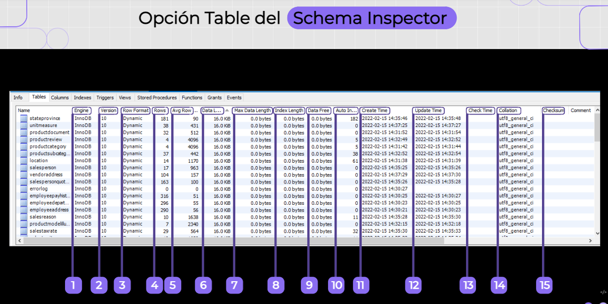

[Ejemplo genially](https://view.genial.ly/6221183de6c9b000107c9545)

Maintenance:
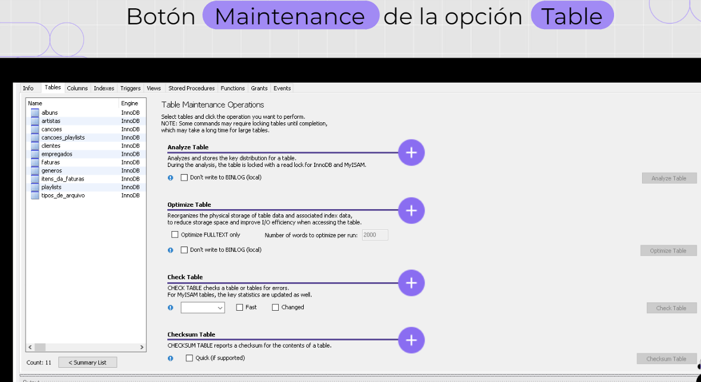

[Ejemplo genially](https://view.genial.ly/6233779aac58ea00138587c8)

Columns:
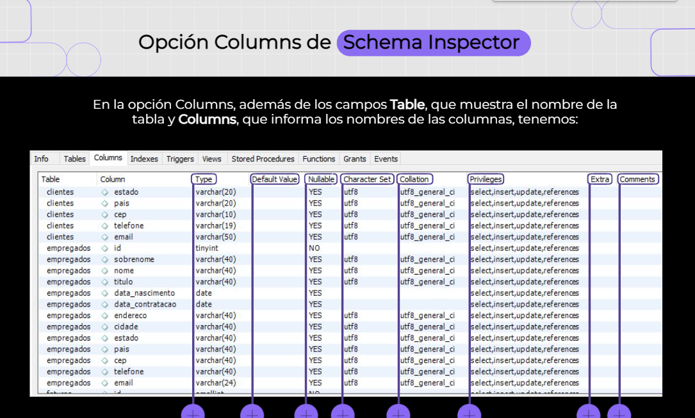

[Ejemplo genially](https://view.genial.ly/62225ed8bb866b0011b145b1)

Triggers y Views:


[Ejemplo genially](https://view.genial.ly/62335a246d5df8001aecb41e)


#### Repaso
1 - Sobre Informe de Optimización es CORRECTO afirmar:
* [ ] Amplía la capacidad de gestión de la base de datos y mejora la productividad del usuario.
* [X] Schema Inspector muestra información de una tabla seleccionada
* [ ] El Table Inspector muestra información para una base de datos seleccionada.

2 - Al eliminar una gran cantidad de registros en una base de datos, ¿qué característica es conveniente aplicar a la tabla? 
* [ ] ANALIZE
* [X] OPTIMIZE
* [ ] CHECKSUM/.

3 -  ¿A través de qué pestaña es posible acceder a las opciones de mantenimiento de tablas? 
* [X] Table.
* [ ] Info.
* [ ] Events.

4 - ¿Qué información podemos encontrar en la pestaña Info del Schema Inspector?
* [X] Cantidad de Tablas y Tamaño de la Base de Datos.
* [ ] Cantidad de Tablas y Cantidad de Índices.
* [ ] Cantidad de Tablas y Cantidad de Columnas.

5 - ¿Qué es Cardinalidad en los informes de optimización?
* [ ] El número de registros repetidos para una columna que contiene un índice.
* [X] El número de registros distintos en una columna que contiene un índice.
* [ ] El número de registros distintos en una tabla.

6 - El comando CHECK:
* [ ] Rehacer las estructuras de los índices..
* [ ] Recuperar espacios no utilizados en una tabla.
* [X] Valida la integridad de una tabla.

7 - Marcar la opción que contiene estructuras de almacenamiento de índices.
* [X] B-Tree, Hash, R-Tree, FullText;
* [ ] Primary, Index, Unique, FullText.
* [ ] Clustered, Non-Clustered

8 - ¿Qué sucede cuando dividimos la cardinalidad por el número de filas en una tabla?
* [X] Tenemos la selectividad del índice, que es la probabilidad de que el optimizador use un índice.
* [ ] Tenemos la cantidad de registros que se pueden devolver en una consulta.
* [ ] Tenemos el número de registros que no se repiten en una columna.

9 - Acerca de la selectividad del índice, ¿qué sucede cuanto más se acerca el resultado a uno?
* [X] Optimizer es más probable que use el índice.
* [ ] Es menos probable que el optimizador utilice el índice..
* [ ] Mayor probabilidad de que el optimizador descarte el índice.

10 - Elija la alternativa correcta con respecto a la Table Inspector. 
* [X] Muestra información sobre una tabla seleccionada.
* [ ] Muestra información sobre la base de datos seleccionada.
* [ ] Muestra información sobre la última consulta procesada.


#### Herramientas <a id='c14'></a>
Las herramientas de profile tienen la función  de monitorear y diagnosticar las consultas  ejecutadas en una Base de Datos.

Hay varias herramientas de creación de perfiles en el mercado como NEOR Profiler SQL, DBeaver, JetProfiler, etc.
La elección de una herramienta depende de la necesidad del desarrollador.
(Más info, clase 14)

#### Repaso
1 - Se utilizan para monitorear y diagnosticar consultas contra una base de datos..
* [ ] Herramientas de optimización.
* [ ] Herramientas de indexación.
* [X] Herramientas de Profile.

2 - ¿Dónde se registra el comportamiento de la consulta procesada en una aplicación?
* [X] LOG
* [ ] CACHE
* [ ] PROFILE

3 -  ¿Cuál es el comando utilizado para habilitar el log de consultas? 
* [X] set global general_log=ON.
* [ ] set global individual_log=ON.
* [ ] set global slow_log=ON.

4 - ¿Cuál es el comando que se usa para ver la variable que almacena una consulta que es lenta? 
* [ ] SHOW VARIABLES LIKE '%show_query_log%';.
* [X] SHOW VARIABLES LIKE '%slow_query_log%';.
* [ ] SHOW INDEX LIKE '%slow_query_log%';.

5 - Señalar la alternativa correcta sobre la función Profile. 
* [X] Es activada siempre que se utiliza.
* [ ] Ya viene habilitada por default.
* [ ] El sistema habilita automáticamente.

6 - Para ver el registro de la consulta ejecutada en DBeaver, ¿es necesario hacer clic en qué botón?
* [X] Show Execution Log.
* [ ] Show Server Output.
* [ ] Show SQL Variables.

7 - En el Panel de salida de DBeaver se puede elegir ver el resultado de la consulta en los formatos..
* [ ] Formato Grid y Metadata.
* [X] Formato Texto y Grid.
* [ ] Formato Texto y Record.

8 - ¿Cómo maximizar un tablero en DBeaver?
* [X] Seleccionando la opción “View Dashboard”, haciendo clic con el botón derecho del ratón sobre uno de ellos.
* [ ] Seleccionando la opción “Zoom In”, haciendo clic derecho en uno de ellos.
* [ ] Seleccionando la opción “Add Dashboard”, haciendo clic con el botón derecho del mouse sobre uno de ellos.

9 - ¿Para qué sirve la herramienta de profiling? 
* [X] Analizar una consulta.
* [ ] Grabar una consulta.
* [ ] Copiar una consulta.

10 - Señalar la alternativa correcta sobre DBeaver. 
* [ ] DBeaver se conecta solo con la base de datos MySQL
* [X] DBeaver se conecta con cualquier base de datos.
* [ ] DBeaver se conecta solo con la base de datos NoSQL.


#### Planes de ejecución
Cada vez que se ejecuta una consulta, sigue un Plan de 
Ejecución elaborado por el optimizador de consultas.
Es él quien, por ejemplo, define el orden de las tablas a consultar, y si va a ejecutar un índice creado o escanear la tabla.
La mayoría de las veces, el optimizador de consultas 
dibuja el mejor plan, que consume menos recursos o tiene más rendimiento


#### Repaso
1 - ¿Qué oración debemos usar para analizar el plan de ejecución de una consulta, elegida por el optimizador?.
* [ ] Optimize
* [X] Explain
* [ ] Analize

2 - Indicá la alternativa correcta sobre la cláusula STRAIGHT_JOIN
* [ ] Mejora la performance de una consulta.
* [X] Ignora el plan de ejecución del optimizador.
* [ ] Retarda la performance de una consulta.

3 -  Señalá la opción correcta sobre el costo de una consulta.
* [ ] El costo está relacionado con la cantidad de datos consultados y el tipo de almacenamiento de índice.
* [ ] sEl costo está relacionado con la cantidad y el tipo de datos consultados
* [X] El costo está relacionado con la utilización del CPU y el tiempo que llevará la consulta.

4 - Cuando el Visual Execution Plan muestra el texto "Full Table Scan", ¿de qué color es la tabla?
* [ ] Azul
* [ ] Verde
* [X] Rojo

5 - ¿Qué significa cuando Explain Visual muestra el mensaje "Index Merge"?
* [ ] La consulta usó el índice correctamente.
* [X] Seleccionó otro índice.
* [ ] El índice se usó con otras columnas.

6 - Cuando aparece el color rojo en el Plan de Ejecución Visual, significa: 
* [X] Quiere decir que la consulta tuvo un costo muy alto.
* [ ] Significa que la consulta tuvo errores.
* [ ] Significa que la cita fue cancelada.

7 - Qué significa cuando aparece el color amarillo en la vista Explain? 
* [ ] Significa búsqueda muy lenta.
* [X] Significa búsqueda de índice Fulltext.
* [ ] Significa búsqueda con Table Scan.

8 - ¿Qué significa el color naranja en Visual Execution Plan?. 
* [ ] Verificación de índice completo
* [X] Verificación de índice parcial
* [ ] Verificación con escaneado total.

9 - ¿Qué significa cuando Visual Execution Plan muestra el mensaje “Full Table Scan”? 
* [ ] Significa que hubo una verificación de índice parcial.
* [ ] Significa que se utilizó una clave única para el procesamiento eficiente de las subconsultas.
* [X] Significa que el optimizador no encontró un índice y realizó un escaneo completo de la tabla.

10 - Señalar la alternativa correcta sobre el Plan de Ejecución Visual. 
* [X] A través del Plan de Ejecución Visual es posible seguir el procesamiento de la consulta en tiempo real
* [ ] A través del Plan de Ejecución visual es posible elegir una consulta para su procesamiento..
* [ ] A través del Plan de Ejecución visual es posible encontrar más fácilmente un problema para actuar en la corrección.

-------
<!--###############################################--  MÓDULO 3 --#####################################################################-->
## Bases de datos no relacionales <a id='m3'></a>
Hasta ahora hemos estudiado las bases de datos  relacionales, donde los datos se almacenan en una  estructura de tablas, es decir, filas y columnas.
El lenguaje utilizado es SQL, que es el lenguaje de  consulta estructurado.
Existe, sin embargo, otro tipo de base de datos, no estructurado, capaz de almacenar y manipular grandes volúmenes de datos de forma rápida y cómoda. Estamos  hablando de NoSQL, que significa Not only SQL o No solo SQL. 


Las bases de datos NoSQL han  existido desde finales de la década de  1960. Sin embargo, el acrónimo  "NoSQL" recién apareció en 2009, provocado por las necesidades de las 
empresas de la Web 2.0 como Facebook, Google y Amazon.com. 


#### Tipos de base de datos NoSQL <a id='c16-1'></a>
■ Columna orientada o Columnar - Almacenar información columna por columna, lo que permite una mayor compresión, alto rendimiento y elimina la necesidad de un índice.
■ Grafo u Orientada a grafos - El propósito de una base de datos de grafos es facilitar la creación y ejecución de aplicaciones que funcionan con conjuntos de datos altamente conectados. Los casos de uso típicos para este tipo de base de datos incluyen redes sociales, motores de recomendación, detección de fraudes y grafos de conocimiento.
■ Orientado a valor-clave o Key-value - Las bases de datos de clave-valor son altamente segmentables y permiten escalas horizontales a escalas que otros tipos de bases de datos no pueden lograr. Casos de uso como juegos, tecnología publicitaria e IoT se prestan particularmente bien al modelo de datos clave-valor.
■ Orientado a documentos - En el código de la aplicación, los datos generalmente se representan como un objeto o documento de tipo JSON, porque es un modelo de datos eficiente e intuitivo para los desarrolladores, lo que facilita su almacenamiento y consulta.

La naturaleza flexible, semi estructurada y jerárquica de los documentos les permite evolucionar con las necesidades de la aplicación. La plantilla de documento funciona bien con catálogos, perfiles de usuario y sistemas de administración de contenido, donde cada documento es único y evoluciona con el tiempo.

#### BBDD SQL vs NOSQL <a id='c16-2'></a>

Las bases de datos NoSQL están diseñadas para casos de usos concretos y tienen esquemas flexibles para crear aplicaciones 
modernas.

Las bases de datos NoSQL son ampliamente  reconocidas por su facilidad de desarrollo, funcionalidad y rendimiento a escala.

####¿Por qué debemos usar una base de datos NoSQL?
Las bases de datos NoSQL se adaptan perfectamente a 
muchas aplicaciones modernas. Como, por ejemplo, dispositivos móviles, web y juegos,  que requieren bases de datos flexibles, escalables, de  alto rendimiento y muy funcionales para ofrecer 
excelentes experiencias de usuario Las bases de datos NoSQL tienen patrones de acceso  que permiten un mayor rendimiento en comparación con una base de datos relacional

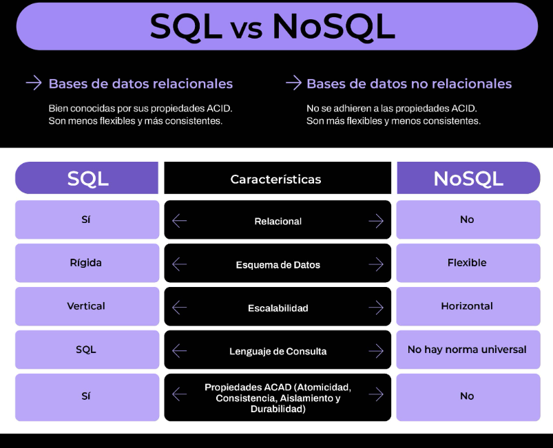

#### Repaso
1 - ¿Qué significa la sigla NoSQL? 
* [X] No solo SQL.
* [ ] No SQL.
* [ ] Noción SQL.

2 - Señale la respuesta correcta sobre bases de datos no relacionales. 
* [ ] Las bases de datos no relacionales tienden a ser menos flexibles y más consistentes.
* [ ] Las bases de datos no relacionales se adhieren a todas las propiedades ACID.
* [X] Las bases de datos no relacionales tienden a ser más flexibles y menos consistentes.

3 -  Señalar los tipos de bases de datos NoSQL .
* [X] Columnas, grafos, documentos y clave-valor
* [ ] Cassandra, MongoDB,grafos y clave-valor.
* [ ] Documentos, tablas, columnas y clave-valor.

4 - Señale la alternativa correcta sobre bases de datos orientadas a documentos.
* [ ] Las bases de datos orientadas a documentos son ideales para crear motores de recomendación.
* [X] Las bases de datos orientadas a documentos se representan como un objeto o documento de tipo JSON.
* [ ] Las bases de datos orientadas a documentos eliminan la necesidad de un índice.

5 - Señalar las características de una base de datos NoSQL 
* [ ] Esquema de datos rígido y escalabilidad vertical.
* [X] Esquema de datos flexible y escalabilidad horizontal.
* [ ] Esquema de datos rígido y escalabilidad horizontal.

6 - ¿En qué año apareció la sigla noSQL?
* [ ] 1960
* [ ] 2006
* [X] 2009

7 - Big Data está relacionado ¿Con qué base de datos?
* [ ] Base de Datos Relacional.
* [X] Base de Datos No Relacional.
* [ ] Base de Datos SQL Server.

8 - Este tipo de Bases de datos son ampliamente reconocidas por su facilidad de desarrollo, funcionalidad y rendimiento a escala. ¿Qué alternativa corresponde a las características mencionadas?  
* [ ] SQL.
* [X] NoSQL.
* [ ] Relacional.


### MongoDB <a id='c17'></a>
MongoDB es una base de datos NoSQL.
Sus características:

● Multiplataforma.

● Orientado a documentos.

● Ofrece alta disponibilidad, alto
desempeño y fácil escalabilidad.

● Trabaja en el concepto de colección y
documento.

Un documento es un conjunto de pares clave-valor.
Los documentos tienen un esquema dinámico. El esquema dinámico significa que los documentos de la misma colección no necesitan tener el mismo conjunto de campos o estructura.
También significa que los campos comunes en los documentos de una colección pueden contener diferentes tipos de datos.

Una colección es un grupo de documentos de MongoDB.
Existe en una única base de datos.
Las colecciones no imponen un esquema.

#### Fortalezas


#### Repaso
1 - MongoDB es:
* [ ] Una Base de datos orientada a columnas.
* [ ] Una Base de datos orientada a grafías.
* [X] Una Base de datos orientada a documentos.

2 - Una colección es:
* [ ] Un conjunto de pares clave-valor.
* [X] Un grupo de documentos.
* [ ] Un conjunto de tablas.

3 -  En general, usamos el modelo de datos incorporados cuando:
* [X] Tenemos una relación uno-a-uno o uno-a-muchos.
* [ ] Tenemos una relación muchos-a-muchos.
* [ ] Cuando queremos modelar un gran conjunto de datos jerárquicos.

4 - Comando utilizado para exhibir la base de datos que está siendo utilizado en el momento:
* [ ] show dbs
* [X] db
* [ ] use

5 - Cuando aparece el color rojo en el Plan de Ejecución Visual, significa: 
* [ ] find().
* [ ] options().
* [X] pretty().

6 - ¿Cuál de los siguientes es un comando utilizado para ordenar documentos? 
* [ ] capped().
* [X] sort().
* [ ] find().

7 - La opción “Filter your data” del panel de Compass filtra: 
* [ ] un término constante en un documento.
* [X] una base de datos.
* [ ] un documento.

8 - ¿Cuál de las siguientes es una notación utilizada para almacenar e intercambiar datos en MongoDB?
* [ ] Java
* [X] Json
* [ ] JavaScript.

9 - Al escribir el comando db para ver qué banco estamos usando, si no hemos seleccionado ninguna base, se desplegará la base:
* [X] test.
* [ ] local.
* [ ] mydb.

10 - Si comparamos el MongoDB con el MySQL, las colecciones son similares a: 
* [X] Las tablas.
* [ ] Las columnas.
* [ ] Los registros.


<!--###############################################--  MÓDULO 4 --#####################################################################-->

## Data never sleeps <a id='m4'></a>