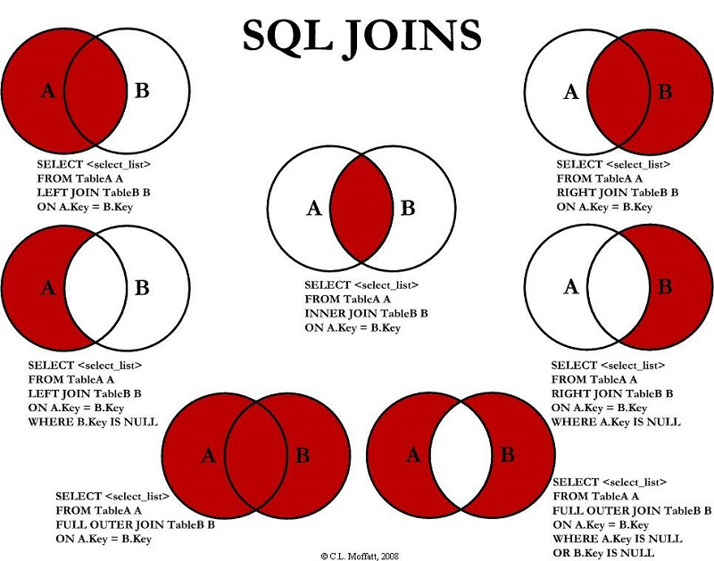
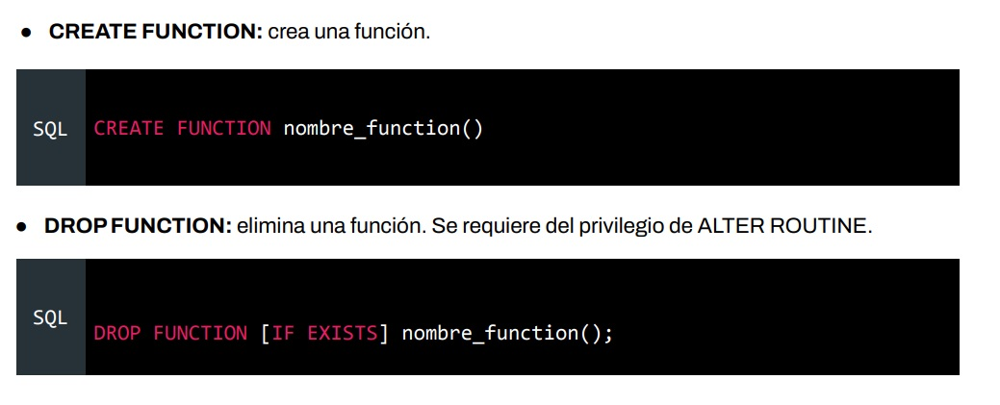
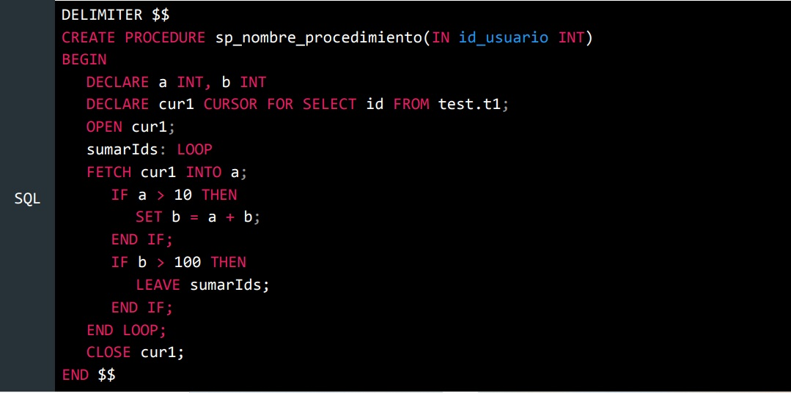

<t>Bases de Datos II <t>

**¿Cuál es nuestro objetivo?**
La información que se produce diariamente, necesita ser manipulada y tratada de manera rápida, óptima y segura, por eso utilizando las herramientas y técnicas aprendidas en la materia Base de datos I e incorporando nuevas funcionalidades y tecnologías, lograremos alcanzar esos objetivos al finalizar esta materia.

Las bases de datos relacionales y no relacionales están provistas de funciones y características complejas que, bien utilizadas, brindan excelentes resultados. El conocimiento y manejo de las mismas es indispensable para cualquier aplicación informática hoy en día.

**¿Qué vamos a lograr?**
Afianzar el pensamiento analítico en la gestión de datos y comprender la trayectoria entre el requerimiento y su implementación física.
Configurar una base de datos relacional y no relacional para que obtenga su mayor performance en grandes volúmenes de datos.
Acceder a la información con el lenguaje propio de la herramienta, de manera tal que los resultados obtenidos sean confiables y seguros.
Lograr la optimización del uso de los datos, de forma que el volumen de los mismos no sea un impedimento en los tiempos de proceso. Reconocer la forma correcta del tratamiento de la información, a fin de no entorpecer el acceso de otros usuarios simultáneamente.
Introducirse en el mundo de Big Data, Data Warehouse, sus conceptos y aplicaciones.

[Cronograma](./Cronograma%20de%20cursada.pdf)
[Programa](./Programa%20Base%20de%20Datos%20II.pdf)

**¿Qué herramientas vamos a utilizar?**
Las bases de datos suelen ser un tema super apasionante. Que las emociones no nos hagan perder el camino y veamos si tenemos todo lo necesario para comenzar.

Para poder trabajar en clase vamos a tener que contar con dos elementos importantes:

- Un gestor de base de datos.
- Una herramienta que nos permita manipular la base de datos.

Ambos deben correr en forma local en nuestras computadoras, por lo cual debemos instalarlos. En el siguiente instructivo vamos a ver cómo instalar MySQL Workbench en los diferentes sistemas operativos.

----------------------

## Índice

1. Módulo 1 - Recordando BD 1

- [Repaso](#m1) 
 - [Insert, Update, Delete](c1a)
 - [Select, Where y Order By, Limit y Offset y Alias](c1b)
 - [Group By Y Having](#c1c)
 - [Joins](#c1d)
- mdts

2. Módulo 2 - Programando en base de datos relacionales
- [Bases de datos relacionales](#m2)  
 - [Funciones](#c4)
    - [Estructura de una función](c4-1)
    - [Características de una función](c4-2)
    - [Create y Drop de una función](c4-3)
    - [Variables de un Función](#c4-4)
        - [Asignar valores a variables](#c4-5)
    - [Parámetros de un función](#c4-6)
         - [parámetro IN](#c4-7)
 - [Procedimientos](#c4-8)
    - [Estructura de un procedimiento](c4-9)
    - [Definición de un procedimiento](c4-10)
    - [Variables de un procedimiento](c4-10)
        - [Asignar valores a variables en procedures](#c4-11)
     - [Parámetros de un procedimiento](#c4-12)
        - [parámetro IN](#c4-13)
        - [parámetro OUT](#c4-14)
        - [parámetro INOUT](#c4-15)
    - [Bloque de sentencias](#c4-16)
- [Control de flujo](#c4-17)
- [Cursor](#c4-18)
    - [Manejo de errores](#c4-19)
    - [Ventajas y desventajas](#c4-20)
- [Procedimientos vs Funciones](#c4-21)

- [Funciones MySQL](#c4-22)
    - [Tipos](#c4-23)
        - [Funciones de cadenas o textos](#c4-24)
        - [Funciones numéricas](#c4-25)
        - [Funciones de fecha](#c4-26)
        - [Funciones de ventana](#c4-27)
        - [Funciones de información](#c4-27)
        - Funciones almacenadas

3. Módulo 3 -  Bases de datos no relacionales
- [Bases de datos no relacionales](#m2)  

4. Módulo 4 -  Data never sleeps 
- [Data](#m4)

------- 
<!--###############################################--  MÓDULO 1--#####################################################################-->
##  Recordando BD 1 
¿Dónde estamos?

[presentación genialy](https://view.genial.ly/62167d51b8bc1d00122e61b3)

Repaso de conceptos básicos en SQL
### Insert, Update, Delete 
[apuntes](./apuntes/2.%20PPT%20Insert%2C%20Update%2C%20Delete%20-%20new.pdf)

### Select, Where y Order By, Limit y Offset y Alias 
[Select](./apuntes/2.%20PPT%20Select.pptx.pdf)
[Where y order by](./apuntes/4.%20PPT%20Where%20y%20Order%20By%20.pdf)
[Limit y Offset](./apuntes/6.%20PPT%20Limit%20y%20Offset.pdf)
[Alias](./apuntes/8.%20PPT%20Alias.pdf)
### Group By Y Having 
[Group by](./apuntes/2.%20PPT%20Group%20By.pdf)
[Having](./apuntes/4.%20PPT%20Having.pdf)
### Joins 
[Joins](./apuntes/2.%20PPT%20Join.pdf)

### Sintaxis 

## clase 1 - mdt 

Consigna: generen cinco enunciados de querys a resolver.
## clase 2 y 3 - mdt
Ejercicios varios de queries para repaso (detalles en carpeta clases)

-------
<!--###############################################--  MÓDULO 2 --#####################################################################-->
## Programando en base de datos relacionales 
En Base de datos I vimos que podíamos crear objetos, manipular datos, hacer operaciones con variables, utilizar funciones y crear procedimientos almacenados básicos.

Durante las siguientes semanas aprenderemos sobre objetos que podemos crear para auditoría, a optimizar nuestras consultas para que funcionen en tiempo razonable y más sentencias para tener la habilidad de realizar operaciones más complejas dentro de una base de datos.

A continuación, profundizaremos en procedimientos almacenados y funciones.

### Funciones 
Una función almacenada en MySQL es una rutina
creada para tomar uno o más parámetros, realizarles algún procedimiento y retornar los resultados en una salida.

■ Pueden incluir parámetros solamente de entrada.
■ Deben retornar un valor con algún tipo de dato
definido.
■ Solo retornan un valor individual, no un conjunto de
registros. A esto se le llaman resultados escalares.

Por lo general, se los utiliza para realizar cálculos sobre los datos, obteniendo así lo que llamamos **datos derivados**. De esta forma, se reduce la necesidad de codificar dicha lógica en programas clientes.

#### Estrutura de una función 
● CREATE FUNCTION: se escribe este comando
seguido del nombre que identificará a la función.
● RETURNS: se utiliza para indicar qué tipo de dato se retornará. La característica es para definir el tipo de función.
● BEGIN: esta cláusula se utiliza para indicar el inicio del código SQL.
● RETURN: utilizamos este comando para retornar el Bloque de instrucciones SQL.
● END: se utiliza para indicar el final del código SQL.

#### Características de una función 

1. DETERMINISTIC: indica que la función siempre devuelve el mismo resultado cuando se utilizan los mismos parámetros de entrada.
2. NOT DETERMINISTIC: indica que la función no siempre devuelve el mismo resultado, aunque se utilicen los mismos parámetros de entrada.
3. CONTAINS SQL: indica que la función contiene sentencias SQL, pero no contiene sentencias de manipulación de datos.
4. NO SQL: indica que la función no contiene
sentencias SQL.
5. READS SQL DATA: indica que contiene sentencias de lectura de datos, como la sentencia SELECT.
6. MODIFIES SQL DATA: indica que la función modifica los datos de la base y que contiene sentencias como INSERT, UPDATE o DELETE.

**Aclaraciones:**
Si no queremos especificar una característica a la función, debemos ejecutar el siguiente comando para que no nos muestre mensaje de error a la hora de crearla:

SET GLOBAL log_bin_trust_function_creators = 1;

No confundir RETURNS con RETURN. La primera es para indicar el tipo de dato de retorno de la función y la segunda es para retornar el valor en el cuerpo de la función.

Si estamos trabajando sobre una query de trabajo, no olvidarse de usar el DELIMITER como se utilizan en los stored procedures.

#### Create y Drop de un Función 

### Variables 
● Dentro de una función se permite declarar variables, es decir, elementos que almacenan datos que pueden ir cambiando a lo largo de la ejecución.
● La declaración de variables se coloca después de la cláusula BEGIN y antes del bloque de instrucciones SQL.
● Opcionalmente, se puede definir un valor inicial mediante la cláusula DEFAULT.

#### Asignación de valores a variables 
● Para asignar un valor a una variable se utiliza la cláusula SET.
● Las variables solo pueden contener valores escalares. Es decir, un solo valor

### Parámetros 
■ Los parámetros son variables por donde se envían y
reciben datos de programas clientes.
■ Se definen dentro de la cláusula CREATE.
■ Las funciones pueden tener uno, varios o ningún
parámetro de entrada.
■ No pueden ingresarse parámetros del tipo OUT o
INOUT.

#### Declaración del parámetro IN 
Es un parámetro de entrada de datos y se utiliza para recibir valores. Este parámetro viene definido por defecto cuando no se especifica su tipo.

----

Podemos decir que las funciones son nuestras
funciones de alteración personalizadas. Mayormente son utilizadas para cuando se necesitan atributos derivados de los datos de nuestras tablas y que se utilicen en varias consultas de nuestro negocio.

Otra ventaja es que el uso de funciones puede ayudar a mejorar en gran medida el rendimiento y la performance general del sistema.

----

### Procedimientos 
Los SP (stored procedure) son un conjunto de
instrucciones en formato SQL que se almacenan, compilan y ejecutan dentro del servidor de bases de datos.

Pueden incluir parámetros de entrada y salida, devolver resultados tabulares o escalares, mensajes para el cliente e invocar instrucciones DDL y DML.

Por lo general, se los utiliza para definir la lógica del negocio dentro de la base de datos y reducir la necesidad de codificar dicha lógica en programas clientes.

#### Estrutura de un procedimiento 

● DELIMITER: se escribe esta cláusula seguida de una combinación de símbolos que no serán utilizados en el interior del SP.
● CREATE PROCEDURE: se escribe este comando
seguido del nombre que identificará al SP.
● BEGIN: Esta cláusula se utiliza para indicar el inicio del código SQL.
● Bloque de instrucciones SQL.
● END: se escribe esta cláusula seguida de la
combinación de símbolos definidos en DELIMITER y se utiliza para indicar el final del código SQL.

Ejemplo:

#### Definición de un procedimiento 

#### Variables de un procedimiento 
Declaración: 
● Dentro de un SP se permite declarar variables que son elementos que almacenan datos que pueden ir cambiando a lo largo de la ejecución.
● La declaración de variables se coloca después de la cláusula BEGIN y antes del bloque de instrucciones SQL.
● Opcionalmente, se puede definir un valor inicial mediante la cláusula DEFAULT.

#### Asignación de valores a variables 
● Para asignar un valor a una variable se utiliza la cláusula SET.
● Las variables solo pueden contener valores escalares. Es decir, un solo valor.

#### Parámetros de un Procedure 
■ Los parámetros son variables por donde se envían y reciben datos de programas clientes.
■ Se definen dentro de la cláusula CREATE.
■ Los SP pueden tener uno, varios o ningún parámetro de entrada y asimismo, pueden tener uno, varios o ningún parámetro de salida.
■ Existen tres tipos de parámetros:

#### Declaración del parámetro IN 
Es un parámetro de entrada de datos y se utiliza para recibir valores. Este parámetro viene definido por defecto cuando no se especifica su tipo.

#### Declaración del parámetro OUT 
Es un parámetro de salida de datos y se utiliza para devolver valores.

#### Declaración del parámetro INOUT 
Es un mismo parámetro que se utiliza para la entrada y salida de datos. Puede recibir valores y devolver los resultados en la misma variable.

#### Bloque de sentencias 
Dentro del bloque BEGIN...END, además de la definición de variables se pueden escribir distintas sentencias para nuestros procedimientos:

■ Sentencias de control de flujo
■ Cursores
■ Manejo de errores

#### Control de flujo 
Cuando necesitamos aplicar condiciones y/o bucles en nuestro programa, MySQL nos brinda las siguientes sentencias:

1. CASE: se utiliza para condicionales complejas.
2. IF: se utiliza para condicionales simples.
3. ITERATE: vuelve a empezar una iteración. Solo se utiliza en Loop, Repeat y While.
4. LEAVE: se utiliza para salir de iteraciones.
5. LOOP: bucle que se ejecuta x cantidad de veces.
6. REPEAT: bucle que se ejecuta hasta que se cumple una condición.
7. RETURN: se utiliza para retornar un valor en una función o procedimiento.
8. WHILE: bucle que se ejecuta mientras se cumpla una condición.

Ejemplos:

### Cursor 
En el resultado de una consulta, ¿cómo podríamos realizar operaciones por cada uno de los registros del resultado?
Para ello existen los cursores, en MySQL tenemos las siguientes sentencias para su definición y uso.

DECLARE: se utiliza para definir el cursor
OPEN: se utiliza para abrir el cursor.
FETCH: se utiliza para asignar el próximo valor del cursor a una variable.
CLOSE: se utiliza para cerrar un cursor.

### Manejo de errores 
Imaginemos que tenemos un error en uno de nuestro procedimiento. ¿Qué realizamos con este error?¿Cómo lo vamos a tratar?
Para esto, MySQL nos permite crear Handlers y
Conditions así podemos aplicar en nuestros programas un correcto manejo de errores.

■ Conditions: son nombres que podemos agregar a los errores para dejar más legible nuestro código.
■ Handlers: Es el manejador de errores. Por cada error que se ejecute, y si esa condición está definida en un handler, el código que definimos será ejecutado.

#### Ventajas y desventajas 

### Procedimientos vs Funciones 

### Funciones de MySQL 
MySQL puede hacer mucho más que simplemente
almacenar y recuperar datos. También podemos realizar manipulaciones en los datos antes de recuperarlos o guardarlos. Ahí es donde entran las Funciones de MySQL.
Las funciones son simplemente piezas de código que realizan algunas operaciones y luego devuelven un resultado. Algunas funciones aceptan parámetros mientras que otras funciones no.

#### Tipos 
■ Funciones de cadenas o textos
■ Funciones numéricas
■ Funciones de fecha
■ Funciones de ventana
■ Funciones de información
■ Funciones almacenadas(*)

(*) Las funciones almacenadas son las que vimos en la clase anterior. Son las que creamos nosotros mismos.

#### Funciones de cadenas o textos 

■ CHARACTER_LENGTH: devuelve la longitud de la cadena —en caracteres—.
■ CONCAT: junta 2 o más cadenas de texto.
■ FORMAT: formatea un número a un formato como "#, ###, ###. ##", redondeado a un número específico de posiciones decimales.
■ INSERT: inserta una cadena dentro de una cadena en la posición especificada y para un cierto número de caracteres.
■ LEFT: extrae varios caracteres de una cadena comenzando desde la izquierda.
■ LOCATE: devuelve la posición de la primera aparición de una subcadena en una cadena.
■ LOWER: convierte una cadena en minúsculas.
■ REPLACE: reemplaza todas las apariciones de una subcadena dentro de una cadena, con una nueva subcadena.
■ UPPER: convierte una cadena en mayúsculas.
■ RIGHT: extrae varios caracteres de una cadena comenzando desde la derecha.
■ SUBSTR: extrae una subcadena de una cadena —comenzando en cualquier posición—.

#### Funciones númericas 
Funciones más utilizadas —quitando las ya conocidas AVG, SUM, MAX, MIN, COUNT—:
■ GREATEST: devuelve el mayor valor de la lista de argumentos.
■ LEAST: devuelve el valor más pequeño de la lista de argumentos.
■ MOD: devuelve el resto de un número dividido por otro número.
■ POW: devuelve el valor de un número elevado a la potencia de otro número.
■ ROUND: redondea un número a un número
específico de decimales.
■ SQRT: devuelve la raíz cuadrada de un número.
■ TRUNCATE: trunca un número al número
especificado de posiciones decimales.

#### Funciones fecha 
■ ADDDATE: agrega un intervalo de hora / fecha a una fecha y luego devuelve la fecha.
■ CURDATE: devuelve la fecha actual.
■ DATEDIFF: devuelve el número de días entre dos valores de fecha.
■ DATE_FORMAT: formatea una fecha.
■ EXTRACT: extrae una parte de una fecha
determinada.
■ LAST_DAY: extrae el último día del mes para una fecha determinada.
■ SEC_TO_TIME: devuelve un valor de tiempo basado en los segundos especificados.

#### Funciones ventana 
Una función de ventana realiza un cálculo en un conjunto de filas de la tabla que de alguna manera están relacionadas con la fila actual. Esto es comparable al tipo de cálculo que se puede hacer con una función de agregación —AVG, COUNT, SUM, etc.—.

Pero, a diferencia de las funciones agregadas normales, el uso de una función de ventana no hace que las filas se agrupen en una sola fila de salida; las filas conservan sus identidades separadas. Detrás de escena, la función de ventana puede acceder a más que solo la fila actual del resultado de la consulta.

Las más utilizadas:
■ FIRST_VALUE: Devuelve el primer valor del primer registro de nuestra consulta.
■ LAG: Devuelve el valor anterior del registro actual que estamos mostrando.
■ LAST_VALUE: Devuelve el valor del último registro de nuestra consulta.
■ LEAD: Devuelve el valor siguiente del registro actual que estamos mostrando.
■ NTILE: Divide la cantidad de resultados por el parámetro que recibe y asigna un grupo a cada uno de los registros.
■ ROW_NUMBER: Devuelve el número de la fila actual dentro de la cantidad de resultados. Los números de filas van desde 1 hasta el número de filas de resultados.

[consulta la documentación aquí](https://dev.mysql.com/doc/refman/8.0/en/window-function-descriptions.html)

#### Funciones información 
Las funciones de información del sistema se utilizan para consultar la información del sistema de la base de datos MySQL.

Se utilizan también para obtener información sobre las conexiones a nuestra base.

[consulta la documentación aquí](https://dev.mysql.com/doc/refman/8.0/en/information-functions.html)

Funciones más utilizadas:

■ CURRENT_ROLE: Devuelve los roles activos actuales del usuario conectado.
■ CURRENT_USER: Devuelve el nombre de usuario y el nombre de host autenticados.
■ DATABASE: Devuelve el nombre de la base de datos actual.
■ LAST_INSERT_ID: Devuelve el valor de la columna AUTOINCREMENT para el último INSERT.
■ ROW_COUNT: Devuelve el número de filas actualizadas.
■ VERSION: Devuelve una cadena que indica la versión del servidor MySQL.

#### Desafío: Funciones de MySQL

-------
<!--###############################################--  MÓDULO 3 --#####################################################################-->
## Bases de datos no relacionales 

<!--###############################################--  MÓDULO 4 --#####################################################################-->

## Data never sleeps 