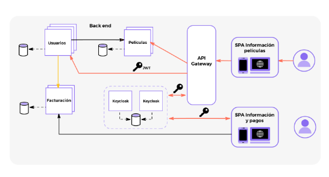
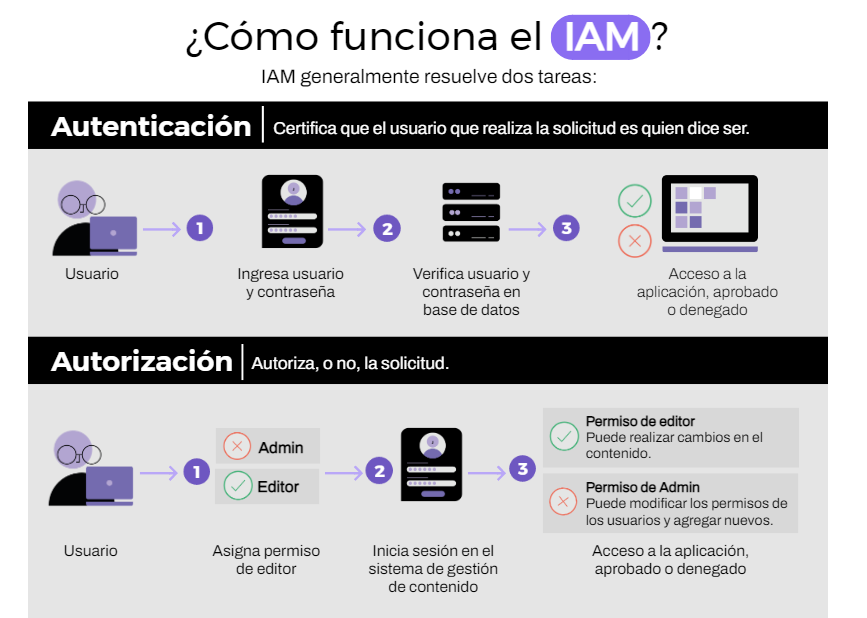
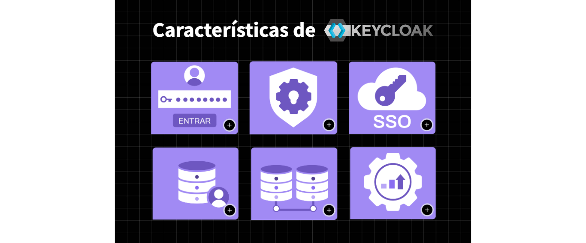

<t>Backend II<t>

**¿Cuál es nuestro objetivo?**
En este curso, vamos a conocer cómo las grandes compañías abordan este tema y cómo resuelven la problemática de la seguridad de una manera más eficiente y menos costosa, delegando este problema a componentes externos que se encargarán de proteger nuestros microservicios, pero también aplicaciones como las SPA o móviles.

**¿Qué vamos a lograr?**

**Objetivos:**

- Adquirir los conocimientos teóricos y prácticos de los marcos de autenticación y autorización más seguros de la industria.

- Diseñar e implementar una arquitectura de seguridad de microservicios a través de un Identity and Access Management.

- Integrar la herramienta de Identity and Access Management en una solución basada en Spring Cloud.

**¿Dónde estamos?**

[presentación genialy](https://view.genial.ly/631a50616dbedd0010f4350a)

[Programa](./INTERNO%20Programa%20de%20Especializaci%C3%B3n%20Back%20End%20II%20-%20Seguridad%20en%20Microservicios-%20V2.html)

----------------------

## Índice

1. Módulo 1 -  

- [IAM](#m1) 

- [Keycloak](#c1)
 - [Características](#c1a)
 - [Instalación](#c1b)
 - [Panel de administración](#c1c)
 - [Creación de reinos](#c1d)
 - [Configuraciones](#c1e)

- [Estándares y autenticación](#c2)
- 
 - 
 - 
 - 
 - 

- [Autenticación avanzada](#c3)
- 
 - 
 - 
 - 
 - 

- [Tokens y sesiones](#c5)
- 
 - 
 - 
 - 
 - 

- mdts

2. Módulo 2 -  

- [Repaso](#m2) 
 - 
 - 
 - 
 - 
- mdts

3. Módulo 3 -  

- [Repaso](#m3) 
 - 
 - 
 - 
 - 
- mdts

4. Módulo 4 -  

- [Repaso](#m4) 
 - 
 - 
 - 
 - 
- mdts

-----------------------------
## Trabajo integrador
Consigna: Usar un middleware de IAM, que centralice la gestión y lógica de seguridad de usuarios para extraer esta responsabilidad de las API. Adicionalmente, plantean la necesidad de centralizar las llamadas a todas las API actuales y futuras API, mediante un proxy intermediario, es decir, mediante un API Gateway.

[PDF](./Trabajo%20Integrador%20-%20Contexto%20.html)

---------------------------------
<!--###############################################--  MÓDULO 1--#####################################################################-->
##  Identity and Access Management
 

Identity and Access Management (administración de identidad y acceso o IAM) es todo lo que sucede detrás de un login. La administración de identidad y acceso permite que las personas puedan acceder (validando su identidad) a los recursos que les corresponden según sea su rol.

Entonces, un Identity and Access Management es un sistema que permite a las personas verificadas acceder a los recursos permitidos en el momento que sea solicitado. IAM viene a resolver la necesidad de garantizar el acceso adecuado a los recursos en entornos tecnológicos cada vez más heterogéneos, cumpliendo con rigurosos requisitos.

[presentación genialy](https://view.genial.ly/6262fdfe093fbb0018e01897)

Los sistemas IAM, como base, proporcionan:

- Gestión de los usuarios: el sistema puede gestionar un repositorio propio de usuarios para crear, modificar y eliminarlos, o puede integrarse con otros repositorios y sincronizarse con ellos. Los usuarios también pueden representar a entidades no humanas, como software, dispositivos IoT o robótica.

- Roles: IAM permite agrupar usuarios según un rol para luego determinar su nivel de acceso. Por ejemplo, administradores, editores, etc.
Autenticación: IAM autentica a un usuario al confirmar que es quien dice ser. Generalmente, se utiliza la autenticación multifactor. Esta consiste en proveer más credenciales generadas de manera distinta a fin de fortalecer la autenticación.

- Autorización: la gestión de accesos garantiza que a un usuario se le otorga el nivel exacto y el tipo de acceso al que tiene derecho.
Reportes: podemos generar reportes sobre las acciones realizadas en la plataforma, como la hora de inicio de sesión, los sistemas a los que se accede y el tipo de autenticación.

- Single sign-on (SSO): permite a los usuarios autenticarse utilizando las credenciales “federadas” en un único portal (por ejemplo: Google o Facebook). De esta manera, no es necesario que el usuario se registre nuevamente con un usuario y contraseña.

- Autenticación de múltiples factores (MFA): en una era en la que las contraseñas a menudo son robadas, el requisito de una prueba de identidad adicional es el nuevo estándar. La autenticación a través de huellas dactilares y las contraseñas de un solo uso son ejemplos de métodos de autenticación comunes.

### Keycloak 

Keycloak es una herramienta de gestión de identidad y acceso de código abierto que se centra en aplicaciones modernas, como SPA (single page application), aplicaciones móviles o API REST. Se utiliza en producción para escenarios que van desde pequeños sitios web con solo un puñado de usuarios hasta grandes empresas con millones de usuarios.

#### Características de Keycloak: 
- páginas de inicio de sesión totalmente personalizables
- puedes delegar los mecanismos de autenticación
- Permite a los usuarios acceder a múltiples aplicaciones autenticándose una única vez
- Tiene su propia base de datos de usuarios
- Es altamente escalable y proporciona alta disponibilidad. 

[presentación genialy](https://view.genial.ly/631f5a89afcd430018b725b2)

[Clientes en Keycloak](./clase%201%20-%2013%20de%20feb%20de%202023/6.%20Clientes%20de%20reinos%20de%20keycloak.pdf)

### Instalación y ejecución de Keycloak 
Keycloak proporciona varias opciones de instalación. Algunas de ellas son:

Ejecutándolo como un contenedor de Docker.
Instalándolo y ejecutándolo localmente utilizando Java.
Ejecutándolo con Kubernetes.
Nosotros vamos a utilizar Docker para ejecutarlo, ya que consideramos que es la opción más simple.

#### Ejecutando Keycloak con Docker

1- Levantar docker 
2- Ejecutar el código siguiente:
<code docker>
docker run -p 8080:8080 -e KEYCLOAK_ADMIN=admin -e KEYCLOAK_ADMIN_PASSWORD=admin quay.io/keycloak/keycloak:18.0.0 start-dev
</code docker>    

El comando de arriba nos permite ejecutar keycloak en un contenedor, en donde además indicamos que queremos exponer el puerto 8080, y configuramos las credenciales para el usuario administrador.

Listo, ahora podemos acceder a http://localhost:8080 para verificar su ejecución.

### Panel de administración 

### Creación de reinos en Keycloak 
Son las entidades que pueden solicitar a Keycloak  la autenticación de un usuario. Generalmente, son aplicaciones y/o servicios que necesitan  autenticar vía single sign-on.
También pueden ser entidades que requieren información del usuario autenticado previamente o un token relacionado con ellos para poder 
invocar a otros servicios de la solución que también usen KeyCloak.

[Crear un reino en Keycloak](./clase%201%20-%2013%20de%20feb%20de%202023/2.%20%C2%BFC%C3%B3mo%20creamos%20un%20reino_.pdf)

### Configuraciones de Keycloak 

Al trabajar de forma local con Keycloak puede ocurrir que necesitemos guardar la configuración de nuestro reino para poder utilizarla en otra computadora o, también, en el caso de que nuestra configuración se pierda y debamos realizarla desde cero. Keycloak nos permite importar y exportar nuestras configuraciones en archivos JSON.

[PASO A PASO - Exportar e importar configuracione de reinos en Keycloak](./clase%201%20-%2013%20de%20feb%20de%202023/2.%20Pasos%20para%20exportar_%20importar%20configuraciones%20en%20Keycloak.pdf)

